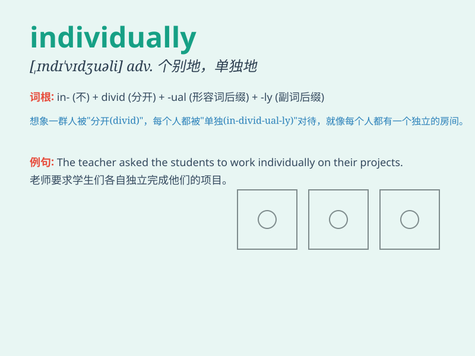

## individually

**英音:** _[ɪndɪ\'vɪdjʊ(ə)lɪ]_ **美音:**
_[ˌɪndɪˈvɪdʒuəli]_

**译义:** *adv.个别地*

### 短语

+ **individually wrapped:** _单独包装的_

+ **individually tailored:** _个性化定制的_

+ **individually designed:** _单独设计的_

+ **individually owned:** _个人拥有的_

+ **individually selected:** _单独挑选的_

### 例句

#### 例句1

> **Each student was assessed individually.**

**中文翻译:** 每个学生都接受单独评估。

**单词释义:** 单独地

#### 例句2

> **The chocolates are sold individually, not in packs.**

**中文翻译:** 巧克力是单独出售的，而不是包装出售的。

**单词释义:** 单个地

#### 例句3

> **The team members work individually on their tasks.**

**中文翻译:** 团队成员单独完成各自的任务。

**单词释义:** 各自地

### 背诵小故事

> A group of friends went on a treasure hunt. But they had to search
individually. Each one explored different areas, and in the end, they
found the treasure by working individually.

**一群朋友去寻宝。但他们必须单独寻找。每个人都探索了不同的区域，最后，他们通过各自单独行动找到了宝藏。**

### 图义

