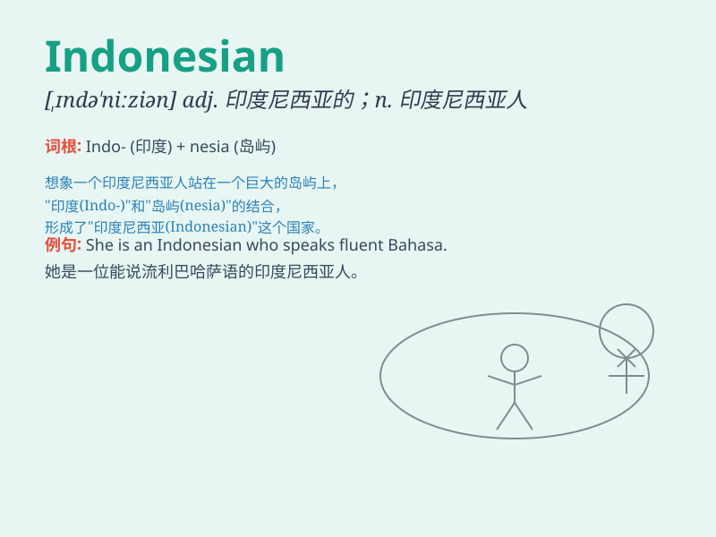

## Indonesian

**英音:** _[ˌɪndəʊˈniːziən]_ **美音:** _[ˌɪndoʊˈniːʒən]_

**译义:** *adj. 印度尼西亚的；印度尼西亚人的 n. 印度尼西亚人*

### 短语

+ **Indonesian cuisine:** _印度尼西亚美食_

+ **Indonesian language:** _印度尼西亚语_

+ **Indonesian culture:** _印度尼西亚文化_

+ **Indonesian people:** _印度尼西亚人_

+ **Indonesian island:** _印度尼西亚岛屿_

### 例句

#### 例句1

> **She is learning the Indonesian language.**

**中文翻译:** 她正在学习印尼语。

**单词释义:** 印尼语；印尼人的

#### 例句2

> **The Indonesian food is very spicy.**

**中文翻译:** 印尼食物非常辣。

**单词释义:** 印尼的；印尼人的

#### 例句3

> **He met an Indonesian tourist in the park.**

**中文翻译:** 他在公园遇到了一位印尼游客。

**单词释义:** 印尼的；印尼人的

### 背诵小故事

> 想象一下，你在印度尼西亚旅行，遇到了一位友好的当地人，他自豪地说：\'I
am an Indonesian.\' 他热情地向你介绍当地的美景和文化。这时，你就记住了
Indonesian 是印度尼西亚人的意思。

**想象一下，你在印度尼西亚旅行，遇到一位友好的当地人，他自豪地说：\'我是印度尼西亚人。\'
他热情地向你介绍当地美景和文化。这时，你就记住了 Indonesian
是印度尼西亚人的意思。**

### 图义

