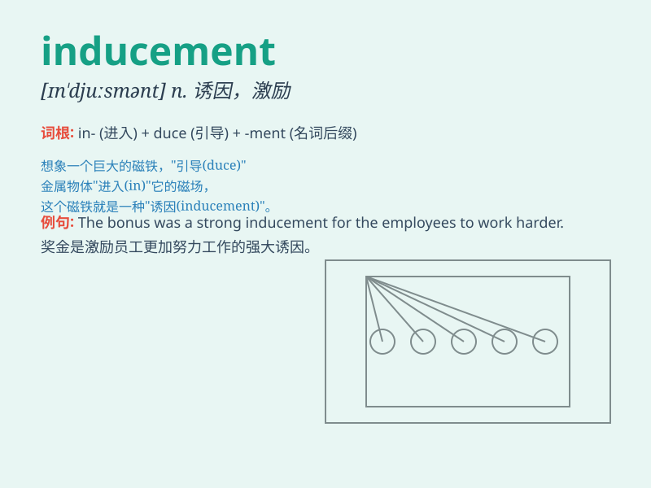

## inducement

**英音:** _[ɪn\'djuːsm(ə)nt]_ **美音:** _[ɪn\'dusmənt]_

**译义:** *n.诱导,诱因,动机,刺激物*

### 短语

+ **offer inducement:** _提供引诱；提供诱惑_

+ **financial inducement:** _财务诱惑；经济诱因_

+ **strong inducement:** _强烈的诱惑；强大的诱因_

+ **resist inducement:** _抵制诱惑；抗拒引诱_

+ **create inducement:** _创造诱因；制造诱惑_

### 例句

#### 例句1

> **The promise of a large bonus was the inducement that made him
take the challenging job.**

**中文翻译:**
一笔丰厚奖金的承诺是促使他接受这份具有挑战性工作的诱因。

**单词释义:** 诱因；刺激物

#### 例句2

> **They offered him an inducement to betray his country.**

**中文翻译:** 他们向他提供诱惑让他背叛自己的国家。

**单词释义:** 诱惑；劝诱

#### 例句3

> **The new policy provides inducements for companies to invest in
research and development.**

**中文翻译:** 新政策为公司投资研发提供了激励措施。

**单词释义:** 激励；鼓励

### 背诵小故事

> A scientist was working hard on a project. The offer of a large grant
was the inducement that made him put in even more effort. It encouraged
and motivated him to achieve great results.

**一位科学家正在努力做一个项目。一笔大额资助的提议是诱导他投入更多努力的因素。它鼓励并激励他取得了巨大的成果。**

### 图义

