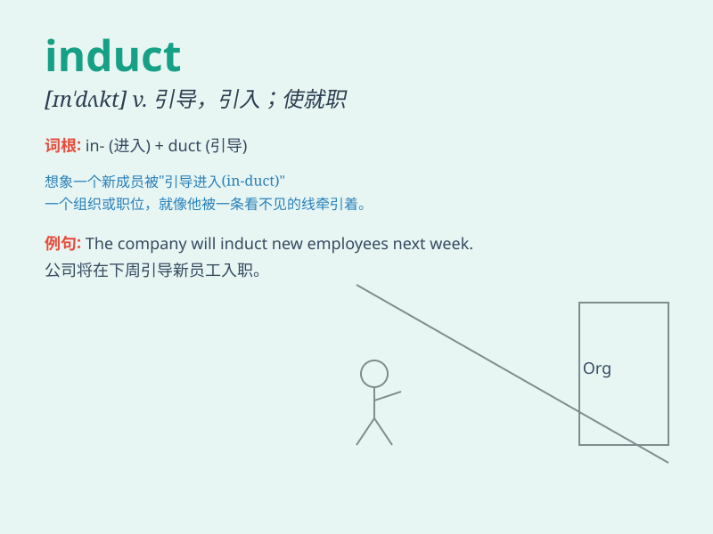

## induct

**英音:** _[ɪn\'dʌkt]_ **美音:** _[ɪn\'dʌkt]_

**译义:** *v.感应*

### 短语

+ **induct someone into something:** _使某人正式加入某组织或团体_

+ **induct into office:** _使就职_

+ **be inducted as:** _被任命为_

+ **induct a member:** _吸收一名成员_

+ **induct someone to do something:** _引导某人做某事_

### 例句

#### 例句1

> **The club will induct new members next month.**

**中文翻译:** 这个俱乐部下个月将吸纳新成员。

**单词释义:** 吸收（成员）

#### 例句2

> **He was inducted into the Hall of Fame last year.**

**中文翻译:** 他去年被引入名人堂。

**单词释义:** 使正式就职；使正式入会

#### 例句3

> **The army inducted him as a soldier.**

**中文翻译:** 军队征他入伍当兵。

**单词释义:** 征召入伍

### 背诵小故事

>
想象一下，在一个古老的仪式上，国王亲自将勇敢的骑士引入（induct）神圣的骑士团。这是一种庄重的接纳，意味着骑士从此肩负起特殊的使命和责任。

**想象在古老仪式上国王将骑士引入骑士团，辅助记忆induct（使正式就职；吸收为成员）这个单词**

### 图义

