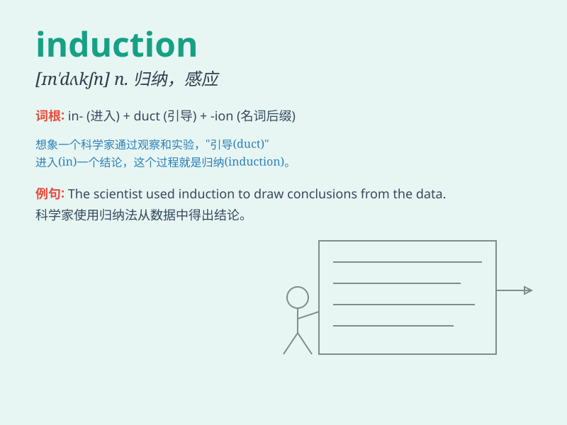

## induction

**英音:** _[ɪn\'dʌkʃ(ə)n]_ **美音:** _[ɪn\'dʌkʃən]_

**译义:** *n.感应,感应现象,归纳*

### 短语

+ **induction course:** _入门课程；入职培训课程_

+ **induction motor:** _感应电动机_

+ **induction heating:** _感应加热_

+ **mathematical induction:** _数学归纳法_

+ **induction ceremony:** _就职典礼；入会仪式_

### 例句

#### 例句1

> **The induction of new employees is an important process.**

**中文翻译:** 新员工的入职培训是一个重要的过程。

**单词释义:** 入职；引入

#### 例句2

> **His induction into the hall of fame was a great honor.**

**中文翻译:** 他入选名人堂是一项极大的荣誉。

**单词释义:** 入选；吸纳

#### 例句3

> **The induction of a new law requires careful consideration.**

**中文翻译:** 一项新法律的推行需要仔细考虑。

**单词释义:** 推行；实施

### 背诵小故事

> A young scientist was excited about his induction into a top research
team. He knew this induction meant new opportunities and challenges. It
was like a key opening the door to a world of advanced knowledge.

**一位年轻的科学家对自己被引入一个顶尖研究团队感到兴奋。他知道这次引入意味着新的机会和挑战。这就像一把钥匙打开了通向先进知识世界的大门。**

### 图义

