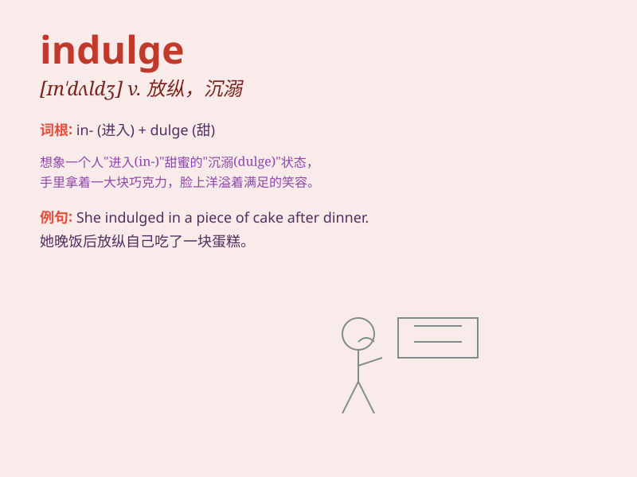

## indulge

**英音:** _[ɪn\'dʌldʒ]_ **美音:** _[ɪn\'dʌldʒ]_

**译义:** *v.纵容*

### 短语

+ **indulge in:** _沉溺于；肆意从事_

+ **indulge oneself:** _放纵自己_

+ **indulge somebody\'s desires:** _满足某人的欲望_

+ **indulge a whim:** _纵容突发的念头_

+ **indulge a child:** _纵容孩子_

### 例句

#### 例句1

> **He indulged himself in expensive hobbies.**

**中文翻译:** 他沉迷于昂贵的爱好。

**单词释义:** 沉迷于；放纵

#### 例句2

> **She indulged in a piece of chocolate cake.**

**中文翻译:** 她尽情享用了一块巧克力蛋糕。

**单词释义:** 尽情享受；放任

#### 例句3

> **Don\'t indulge your children too much.**

**中文翻译:** 别太纵容你的孩子。

**单词释义:** 纵容；迁就

### 背诵小故事

> A king named Indulge loved to enjoy luxurious feasts. He would always
indulge in rich foods and wines. But later, he realized it was bad for
his health and changed. Remember, \'indulge\' means to give in to
desires freely.

**有一位叫因杜尔格的国王，喜欢享受奢华的盛宴。他总是纵情于丰盛的食物和美酒。但后来，他意识到这对健康不利并做出了改变。记住，'indulge'意思是放纵、沉溺。**

### 图义

