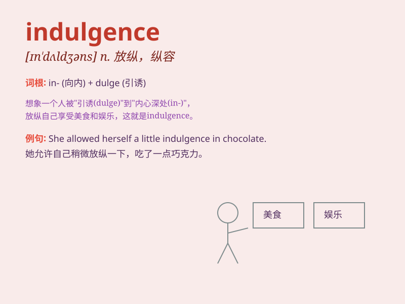

## indulgence

**英音:** _[ɪn\'dʌldʒ(ə)ns]_ **美音:** _[ɪn\'dʌldʒəns]_

**译义:** *n.放任*

### 短语

+ **indulgence in:** _沉溺于；肆意从事_

+ **self-indulgence:** _自我放纵；任性_

+ **grant indulgence:** _给予宽容；准许放纵_

+ **excessive indulgence:** _过度放纵；过分纵容_

+ **indulgence of desires:** _欲望的放纵_

### 例句

#### 例句1

> **He often allows himself the indulgence of a rich dessert after
dinner.**

**中文翻译:** 他经常在晚饭后纵容自己吃一份丰盛的甜点。

**单词释义:** 纵容；放纵

#### 例句2

> **The spa offers various indulgences for relaxation and
rejuvenation.**

**中文翻译:** 这个水疗中心提供各种让人放松和恢复活力的享受。

**单词释义:** 享受；沉溺

#### 例句3

> **Her indulgence in shopping has led to a significant debt.**

**中文翻译:** 她购物的放纵导致了巨额债务。

**单词释义:** 放纵；沉迷

### 背诵小故事

> A king was known for his indulgence. He always ate too much cake and
spent all his time playing. But one day, he realized this was not good
and changed. Remember, indulgence means giving in too much to your
desires.

**一位国王以放纵著称。他总是吃太多蛋糕，把所有时间都用来玩耍。但有一天，他意识到这不好并做出了改变。记住，indulgence
意思是过度纵容自己的欲望。**

### 图义

