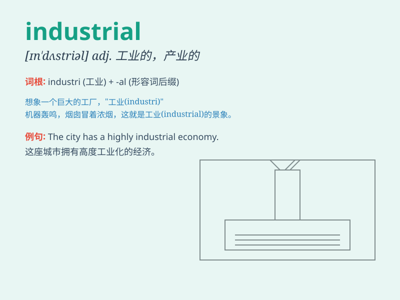

## industrial

**英音:** _[ɪn\'dʌstrɪəl]_ **美音:** _[ɪn\'dʌstrɪəl]_

**译义:**
*adj.工业的,产业的,实业的,从事工业的n.工业工人,[商]工业股票*

### 短语

+ **industrial park:** _工业园区_

+ **industrial revolution:** _工业革命_

+ **industrial waste:** _工业废料_

+ **industrial production:** _工业生产_

+ **industrial design:** _工业设计_

### 例句

#### 例句1

> **The city has a strong industrial base.**

**中文翻译:** 这个城市有强大的工业基础。

**单词释义:** 工业的

#### 例句2

> **Industrial pollution is a serious problem.**

**中文翻译:** 工业污染是一个严重的问题。

**单词释义:** 工业的

#### 例句3

> **The country is in the process of industrialization.**

**中文翻译:** 这个国家正处于工业化进程中。

**单词释义:** 工业化的

### 背诵小故事

> Imagine a huge factory with many machines running non-stop. Workers
are busy making products. This scene represents \'industrial\'. It\'s
all about large-scale production and manufacturing.

**想象一个巨大的工厂，许多机器不停地运转。工人们正忙着制造产品。这个场景代表了'industrial'。它关乎大规模的生产和制造。**

### 图义

