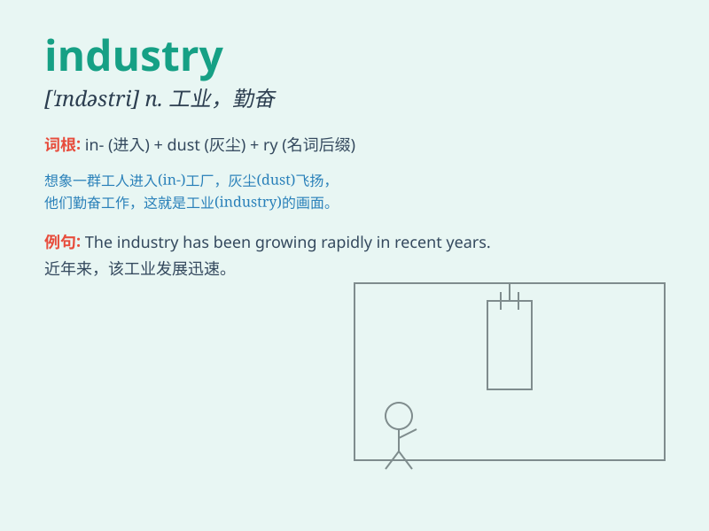

## industry

**英音:** _[\'ɪndəstrɪ]_ **美音:** _[\'ɪndəstri]_

**译义:** *n.工业,产业,行业,勤奋*

### 短语

+ **heavy industry:** _重工业_

+ **light industry:** _轻工业_

+ **service industry:** _服务业_

+ **tourism industry:** _旅游业_

+ **film industry:** _电影业_

### 例句

#### 例句1

> **The automotive industry is undergoing rapid transformation.**

**中文翻译:** 汽车行业正在经历快速的变革。

**单词释义:** 行业

#### 例句2

> **She has made significant contributions to the fashion
industry.**

**中文翻译:** 她对时尚业做出了重大贡献。

**单词释义:** 行业

#### 例句3

> **The country\'s heavy industry is very developed.**

**中文翻译:** 这个国家的重工业非常发达。

**单词释义:** 工业

### 背诵小故事

> A long time ago, there was a small village. Everyone worked hard to
build many factories. These factories made various products and the
village became famous for its production. This is how the word
\'industry\' came to represent all these productive activities.

**很久以前，有一个小村庄。每个人都努力工作建立了许多工厂。这些工厂制造了各种各样的产品，这个村庄因其生产而出名。这就是单词\'industry\'（工业；行业）如何代表所有这些生产活动的。**

### 图义

