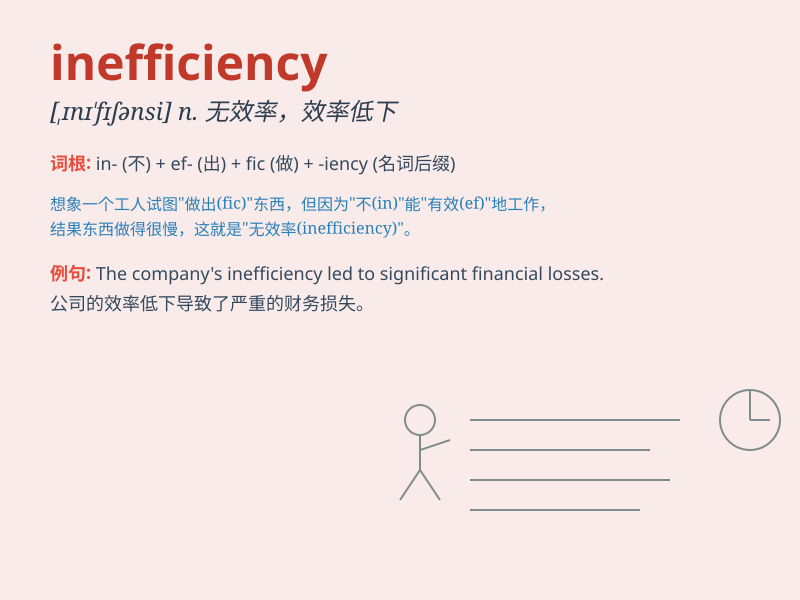

## inefficiency

**英音:** _[,ɪnɪ\'fɪʃənsɪ]_ **美音:** _[ɪnə\'fɪʃənsi]_

**译义:** *n.无效率,无能*

### 短语

+ **operational inefficiency:** _运营效率低下_

+ **economic inefficiency:** _经济效率低下_

+ **resource inefficiency:** _资源利用效率低下_

+ **systemic inefficiency:** _系统性效率低下_

+ **administrative inefficiency:** _行政效率低下_

### 例句

#### 例句1

> **The inefficiency of the old system led to many problems.**

**中文翻译:** 旧系统的效率低下导致了许多问题。

**单词释义:** 效率低下；无效率

#### 例句2

> **We need to address the inefficiency in our production
process.**

**中文翻译:** 我们需要解决我们生产过程中的效率低下问题。

**单词释义:** 效率低下；无效率

#### 例句3

> **His inefficiency at work made him lose the promotion
opportunity.**

**中文翻译:** 他工作效率低下使他失去了晋升机会。

**单词释义:** 效率低下；无效率

### 背诵小故事

> A factory was losing money due to inefficiency. Workers were always
late, machines broke often, and the management was chaotic. This led to
poor production and lots of waste. Finally, they realized inefficiency
was the root cause.

**一家工厂由于效率低下而亏损。工人们总是迟到，机器经常出故障，管理也很混乱。这导致了产量不佳和大量浪费。最后，他们意识到效率低下是根本原因。**

### 图义

