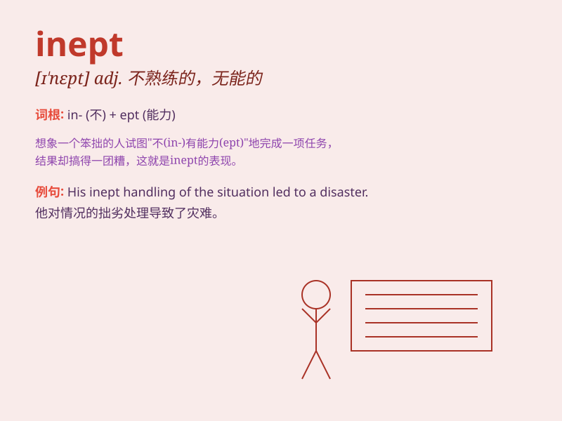

## inept

**英音:** _[ɪˈnept]_ **美音:** _[ɪˈnept]_

**译义:** *adj.不适当的,无能的,不称职的*

### 短语

+ **inept handling:** _不熟练的处理_

+ **inept attempt:** _笨拙的尝试_

+ **inept performance:** _无能的表现_

+ **inept worker:** _不称职的工人_

+ **inept leader:** _无能的领导_

### 例句

#### 例句1

> **He is inept at handling such matters.**

**中文翻译:** 他不善于处理这类事情。

**单词释义:** 不善于；无能的

#### 例句2

> **The inept performance of the team disappointed the fans.**

**中文翻译:** 这个团队拙劣的表现让粉丝们感到失望。

**单词释义:** 拙劣的；无能的

#### 例句3

> **She made an inept attempt to fix the computer.**

**中文翻译:** 她试图修电脑，但是方法很笨拙。

**单词释义:** 笨拙的；不恰当的

### 背诵小故事

> A king sent an inept knight to fight. The knight didn\'t know how to
use his sword and always fell off his horse. Everyone laughed at him for
being so clumsy and unskilled.

**一位国王派了一个无能的骑士去战斗。这个骑士不知道如何使用他的剑，还总是从马上摔下来。每个人都嘲笑他如此笨拙和不熟练。**

### 图义

