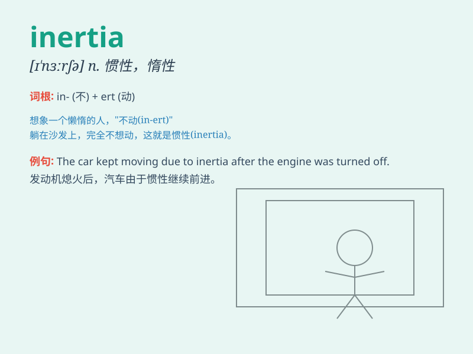

## inertia

**英音:** _[ɪ\'nɜːʃə]_ **美音:** _[ɪ\'nɝʃə]_

**译义:** *n.惯性,惯量*

### 短语

+ **moment of inertia:** _转动惯量；惯性矩_

+ **inertia force:** _惯性力_

+ **inertia moment:** _惯性矩；惯量矩_

+ **inertia tensor:** _惯性张量_

+ **rotational inertia:** _转动惯性；转动惯量_

### 例句

#### 例句1

> **The car\'s inertia carried it forward even after the brakes were
applied.**

**中文翻译:** 汽车的惯性使它在刹车后仍向前滑行。

**单词释义:** 惯性

#### 例句2

> **He found it difficult to overcome his inertia and start
exercising regularly.**

**中文翻译:** 他发现很难克服自己的惰性，开始定期锻炼。

**单词释义:** 惰性；缺乏活力

#### 例句3

> **The inertia of the bureaucratic system prevented rapid
change.**

**中文翻译:** 官僚体制的惯性阻碍了快速变革。

**单词释义:** 惯性；因循守旧

### 背诵小故事

> A spaceship was traveling through space. The crew wanted to change
direction but faced difficulty due to the inertia of the massive ship.
It just kept moving forward, resisting any sudden change. Inertia is
like this force that keeps things going as they are.

**一艘宇宙飞船在太空中航行。船员们想要改变方向，但由于巨大飞船的惯性而面临困难。它只是继续向前移动，抵制任何突然的变化。惯性就像这样一种力量，让事物保持原有的运动状态。**

### 图义

