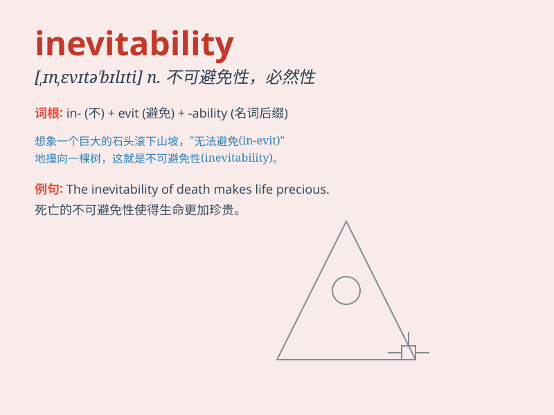

## inevitability

**英音:** _[ɪn,evɪtə\'bɪlətɪ]_ **美音:**
_[,ɪnɛvətə\'bɪləti]_

**译义:** *n.必然性*

### 短语

+ **the inevitability of death:** _死亡的必然性_

+ **inevitability of change:** _变化的必然性_

+ **recognize the inevitability:** _认识到必然性_

+ **accept the inevitability:** _接受必然性_

+ **inevitability of fate:** _命运的必然性_

### 例句

#### 例句1

> **The inevitability of death is a universal truth.**

**中文翻译:** 死亡的必然性是一个普遍的真理。

**单词释义:** 必然性

#### 例句2

> **He accepted the inevitability of the situation and moved on.**

**中文翻译:** 他接受了这种情况的必然性，然后继续前进。

**单词释义:** 必然性

#### 例句3

> **The inevitability of change in our lives should be embraced.**

**中文翻译:** 我们生活中变化的必然性应该被接受。

**单词释义:** 必然性

### 背诵小故事

> A brave adventurer was on a long journey. Despite all his efforts and
precautions, he faced many challenges. Eventually, he realized the
inevitability of some setbacks and learned to accept them.

**一位勇敢的冒险家正在长途旅行。尽管他尽了一切努力并采取了预防措施，但还是面临了许多挑战。最终，他意识到一些挫折的不可避免性，并学会了接受它们。**

### 图义

