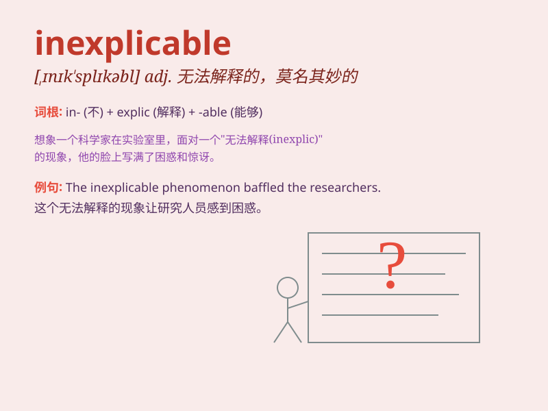

## inexplicable

**英音:** _[,ɪnɪk\'splɪkəb(ə)l; ,ɪnek-; ɪn\'eksplɪ-]_
**美音:** _[,ɪnɪk\'splɪkəbl]_

**译义:** *adj.无法说明的*

### 短语

+ **inexplicable mystery:** _无法解释的谜团_

+ **inexplicable behavior:** _难以解释的行为_

+ **inexplicable phenomenon:** _费解的现象_

+ **inexplicable feeling:** _莫名其妙的感觉_

+ **inexplicable disappearance:** _无法解释的消失_

### 例句

#### 例句1

> **The disappearance of the plane is still inexplicable.**

**中文翻译:** 飞机的失踪至今仍令人费解。

**单词释义:** 无法解释的

#### 例句2

> **There was an inexplicable change in his behavior.**

**中文翻译:** 他的行为发生了莫名的变化。

**单词释义:** 无法解释的

#### 例句3

> **The inexplicable phenomenon has puzzled scientists for years.**

**中文翻译:** 这种无法解释的现象多年来一直困扰着科学家。

**单词释义:** 无法解释的

### 背诵小故事

> One day, I witnessed a strange event. A bird flew in a circle and
then vanished without a trace. It was inexplicable. No one could explain
why it happened. It was just so mysterious and beyond understanding.

**有一天，我目睹了一件奇怪的事。一只鸟飞着飞着绕了个圈然后就消失得无影无踪。这无法解释。没人能解释为什么会这样。就是如此神秘和难以理解。**

### 图义

