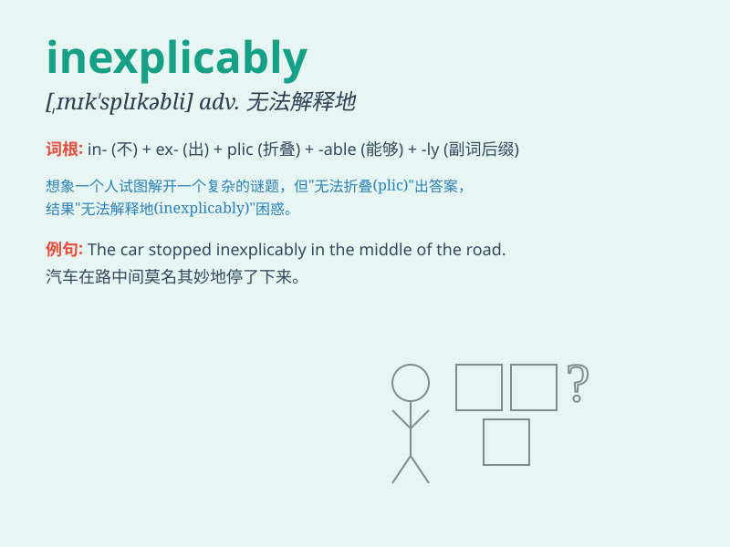

## inexplicably

**英音:** _[ɪn\'eksplɪkəblɪ]_ **美音:**
_[ɪn\'eksplɪkəblɪ]_

**译义:** *adv.到无法说明的程度*

### 短语

+ **inexplicably absent:** _莫名其妙地缺席_

+ **inexplicably late:** _莫名其妙地迟到_

+ **inexplicably changed:** _莫名其妙地改变_

+ **inexplicably quiet:** _莫名其妙地安静_

+ **inexplicably happy:** _莫名其妙地高兴_

### 例句

#### 例句1

> **Inexplicably, she suddenly became angry.**

**中文翻译:** 莫名的，她突然生气了。

**单词释义:** 无法解释地；难以理解地

#### 例句2

> **The door inexplicably opened by itself.**

**中文翻译:** 门莫名其妙地自动打开了。

**单词释义:** 难以说明地；费解地

#### 例句3

> **He inexplicably failed the exam despite his hard work.**

**中文翻译:** 尽管他很努力，但考试还是莫名其妙地失败了。

**单词释义:** 令人难以理解地

### 背诵小故事

> One day, Tom\'s pet dog vanished inexplicably. Everyone was confused
as there was no sign of how it happened. Tom searched everywhere but
couldn\'t find any clue. It was a truly mysterious and inexplicable
event.

**有一天，汤姆的宠物狗莫名其妙地消失了。每个人都很困惑，因为不知道是怎么回事。汤姆到处找，但找不到任何线索。这真是一件神秘又无法解释的事情。**

### 图义

