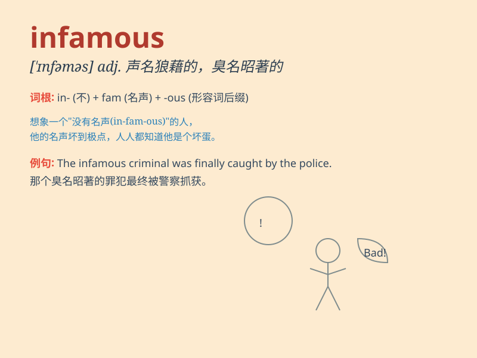

## infamous

**英音:** _[\'ɪnfəməs]_ **美音:** _[\'ɪnfəməs]_

**译义:** *adj.声名狼籍的*

### 短语

+ **infamous crime:** _臭名昭著的罪行_

+ **infamous reputation:** _恶名昭彰的名声_

+ **infamous incident:** _声名狼藉的事件_

+ **infamous history:** _不光彩的历史_

+ **infamous figure:** _声名狼藉的人物_

### 例句

#### 例句1

> **He is infamous for his dishonest business practices.**

**中文翻译:** 他因不诚实的商业行为而臭名昭著。

**单词释义:** 声名狼藉的

#### 例句2

> **The infamous criminal was finally caught by the police.**

**中文翻译:** 这个臭名昭著的罪犯最终被警方抓获。

**单词释义:** 臭名昭著的

#### 例句3

> **This area is infamous for its high crime rate.**

**中文翻译:** 该地区因其高犯罪率而臭名昭著。

**单词释义:** 声名狼藉的

### 背诵小故事

> Once upon a time, there was a thief who was infamous in the town.
Everyone knew his bad deeds and avoided him. \'Infamous\' means being
well-known for something bad or evil, just like this thief\'s
reputation.

**从前，镇上有个小偷声名狼藉。每个人都知道他的恶行并避开他。'infamous'意思是因坏事或邪恶的事而广为人知，就像这个小偷的名声一样。**

### 图义

