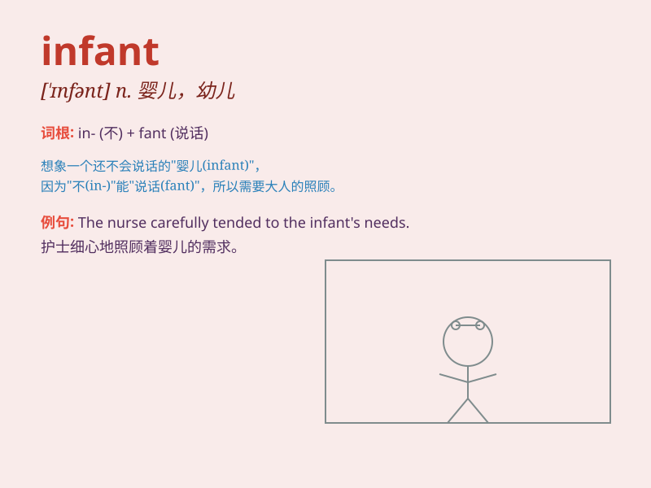

## infant

**英音:** _[\'ɪnf(ə)nt]_ **美音:** _[\'ɪnfənt]_

**译义:** *n.婴儿,幼儿adj.婴儿的,幼稚的*

### 短语

+ **infant school:** _幼儿学校_

+ **infant mortality:** _婴儿死亡率_

+ **infant formula:** _婴儿配方奶粉_

+ **premature infant:** _早产儿_

+ **newborn infant:** _新生儿_

### 例句

#### 例句1

> **The infant was crying loudly in the crib.**

**中文翻译:** 婴儿床上的婴儿正在大声哭泣。

**单词释义:** 婴儿

#### 例句2

> **She is an expert in infant care.**

**中文翻译:** 她是婴儿护理方面的专家。

**单词释义:** 婴儿

#### 例句3

> **The infant\'s smile melted my heart.**

**中文翻译:** 婴儿的笑容融化了我的心。

**单词释义:** 婴儿

### 背诵小故事

>
想象一下，在一个古老的小镇，有个小宝宝被放在温暖的摇篮里。这个小宝宝还不会说话走路，是个非常幼小的生命，我们称这样的小宝宝为
infant。

**想象在古老小镇里有个还不会说话走路的小宝宝在摇篮里，这样幼小的生命被称为
infant（婴儿，幼儿）**

### 图义

