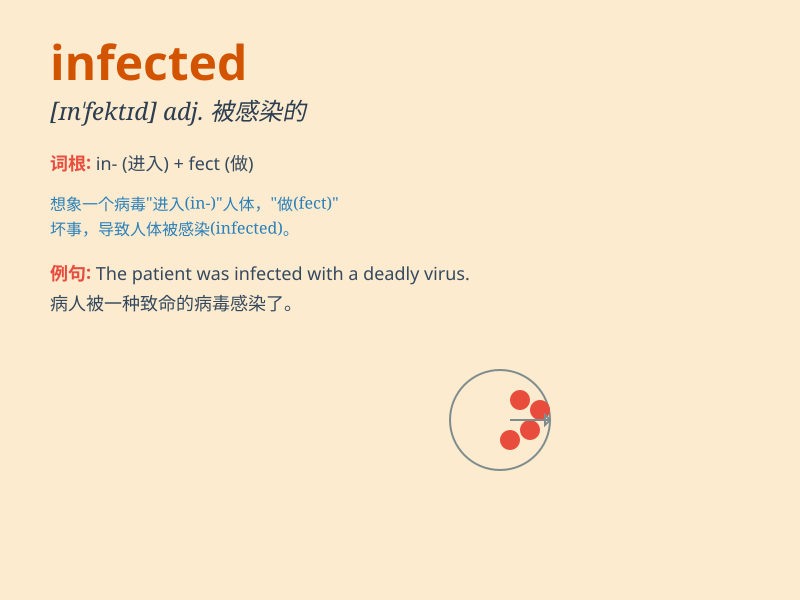

## infected

**英音:** _[ɪn\'fektɪd]_ **美音:** _[ɪn\'fɛktɪd]_

**译义:** *adj.(伤口)被感染的*

### 短语

+ **infected area:** _受感染的区域_

+ **infected wound:** _感染的伤口_

+ **infected person:** _受感染的人_

+ **become infected:** _被感染_

+ **infected blood:** _受感染的血液_

### 例句

#### 例句1

> **The wound was infected and needed immediate treatment.**

**中文翻译:** 伤口感染，需要立即治疗。

**单词释义:** 被感染的

#### 例句2

> **He was infected with the flu virus.**

**中文翻译:** 他感染了流感病毒。

**单词释义:** 感染

#### 例句3

> **The entire area was infected by the disease.**

**中文翻译:** 整个地区都被这种疾病感染了。

**单词释义:** 被感染

### 背诵小故事

> A brave doctor was working in a small town. One day, a patient came
with a strange illness. After examination, the doctor found the patient
was infected. But the doctor didn\'t give up and tried hard to cure him.

**一位勇敢的医生在一个小镇工作。有一天，一位病人带着奇怪的病症前来。检查后，医生发现病人被感染了。但医生没有放弃，努力去治愈他。**

### 图义

