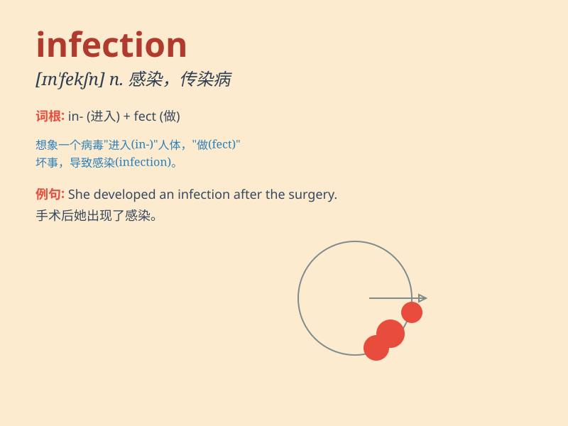

## infection

**英音:** _[ɪn\'fekʃ(ə)n]_ **美音:** _[ɪn\'fɛkʃən]_

**译义:** *n.[医] 传染,传染病,影响,感染*

### 短语

+ **viral infection:** _病毒感染_

+ **bacterial infection:** _细菌感染_

+ **fungal infection:** _真菌感染_

+ **respiratory infection:** _呼吸道感染_

+ **skin infection:** _皮肤感染_

### 例句

#### 例句1

> **The infection spread rapidly throughout the hospital.**

**中文翻译:** 感染在整个医院迅速蔓延。

**单词释义:** 感染；传染

#### 例句2

> **She is recovering from a chest infection.**

**中文翻译:** 她的胸部感染正在康复中。

**单词释义:** 感染；传染病

#### 例句3

> **Antibiotics are used to treat bacterial infections.**

**中文翻译:** 抗生素用于治疗细菌感染。

**单词释义:** 感染；传染

### 背诵小故事

> A brave doctor was in a small town. One day, a mysterious disease
spread. Many people got sick. The doctor found it was an infection. He
worked hard to stop it and save the town.

**一位勇敢的医生在一个小镇上。有一天，一种神秘的疾病传播开来。许多人生病了。医生发现这是一种感染。他努力工作来阻止它并拯救了小镇。**

### 图义

