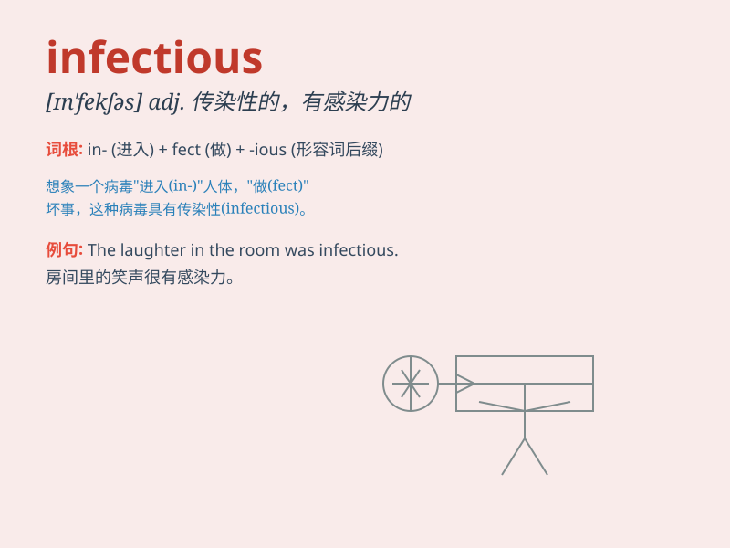

## infectious

**英音:** _[ɪn\'fekʃəs]_ **美音:** _[ɪn\'fɛkʃəs]_

**译义:** *adj.有传染性的,易传染的,有感染力的*

### 短语

+ **infectious disease:** _传染病_

+ **infectious agent:** _传染因子；传染原；病原体_

+ **infectious smile:** _有感染力的微笑_

+ **infectious enthusiasm:** _富有感染力的热情_

+ **infectious laughter:** _有感染力的笑声_

### 例句

#### 例句1

> **The flu is highly infectious and can spread quickly.**

**中文翻译:** 流感传染性极强，传播速度很快。

**单词释义:** 传染性的

#### 例句2

> **She has an infectious laugh that brightens up the room.**

**中文翻译:** 她的笑声很有感染力，让整个房间都明亮起来。

**单词释义:** 有感染力的

#### 例句3

> **His enthusiasm for music is infectious; soon everyone was joining
in.**

**中文翻译:** 他对音乐的热情极具感染力。很快大家都加入了进来。

**单词释义:** 有感染力的

### 背诵小故事

> A doctor was dealing with a strange disease. The virus causing it was
very infectious. One patient spread it to many others quickly. But the
doctor found a way to stop the infectious spread.

**一位医生正在处理一种奇怪的疾病。引发它的病毒极具传染性。一名患者很快就将其传染给了许多其他人。但医生找到了阻止这种传染性传播的方法。**

### 图义

