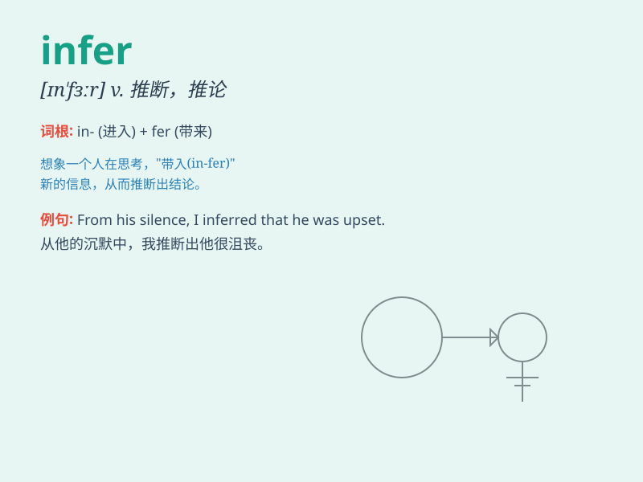

## infer

**英音:** _[ɪn\'fɜː]_ **美音:** _[ɪn\'fɝ]_

**译义:** *v.推断*

### 短语

+ **infer from:** _从......推断出_

+ **infer meaning:** _推断含义_

+ **infer conclusion:** _推断出结论_

+ **infer intention:** _推测意图_

+ **infer relation:** _推断关系_

### 例句

#### 例句1

> **I inferred from her expression that she was angry.**

**中文翻译:** 我从她的表情推断出她很生气。

**单词释义:** 推断；推论

#### 例句2

> **What can we infer from these facts?**

**中文翻译:** 从这些事实我们可以推断出什么？

**单词释义:** 推断；得出结论

#### 例句3

> **It is reasonable to infer that he will come.**

**中文翻译:** 有理由推断他会来。

**单词释义:** 推断；猜测

### 背诵小故事

> A detective was at a crime scene. He saw some footprints and broken
glasses. From these clues, he inferred that the thief had run away in a
hurry.

**一位侦探在犯罪现场。他看到一些脚印和破碎的玻璃。从这些线索，他推断出小偷匆忙逃跑了。**

### 图义

