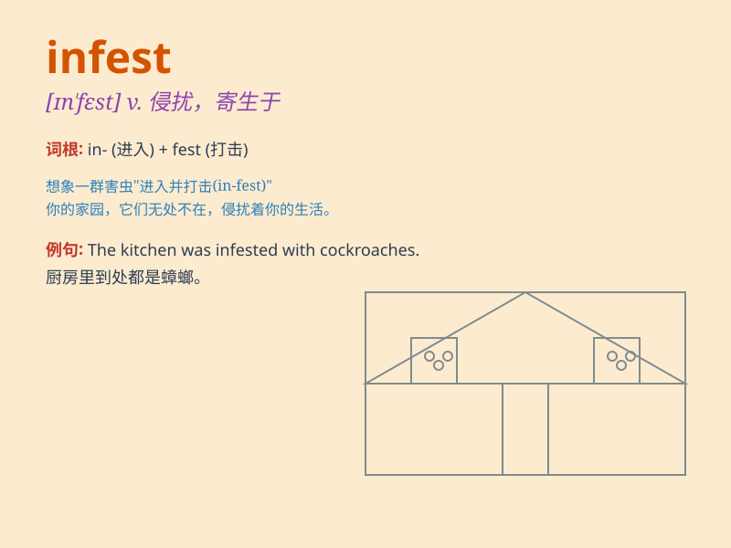

## infest

**英音:** _[ɪn\'fest]_ **美音:** _[ɪn\'fɛst]_

**译义:** *v.大批滋生*

### 短语

+ **infest with:** _被......侵扰；充满......_

+ **infest area:** _侵扰地区_

+ **infest crops:** _侵害庄稼_

+ **infest housing:** _侵扰房屋_

+ **infest forest:** _侵扰森林_

### 例句

#### 例句1

> **The house was infested with rats.**

**中文翻译:** 房子里老鼠出没。

**单词释义:** （害虫、老鼠等）大批出没于，侵扰

#### 例句2

> **Mosquitoes infest the swampy area.**

**中文翻译:** 蚊子在沼泽地区出没。

**单词释义:** 大批滋生，大批出没于

#### 例句3

> **The garden is infested with weeds.**

**中文翻译:** 花园里杂草丛生。

**单词释义:** （害虫、杂草等）侵扰，泛滥

### 背诵小故事

> Imagine a dark old house full of rats. These rats \'infest\' the
house, meaning they are present in large numbers and causing trouble
everywhere. It\'s like a pest invasion.

**想象一个黑暗的老房子里满是老鼠。这些老鼠"侵扰"了这所房子，意味着它们大量存在并且到处惹麻烦。这就像是害虫的入侵。**

### 图义

