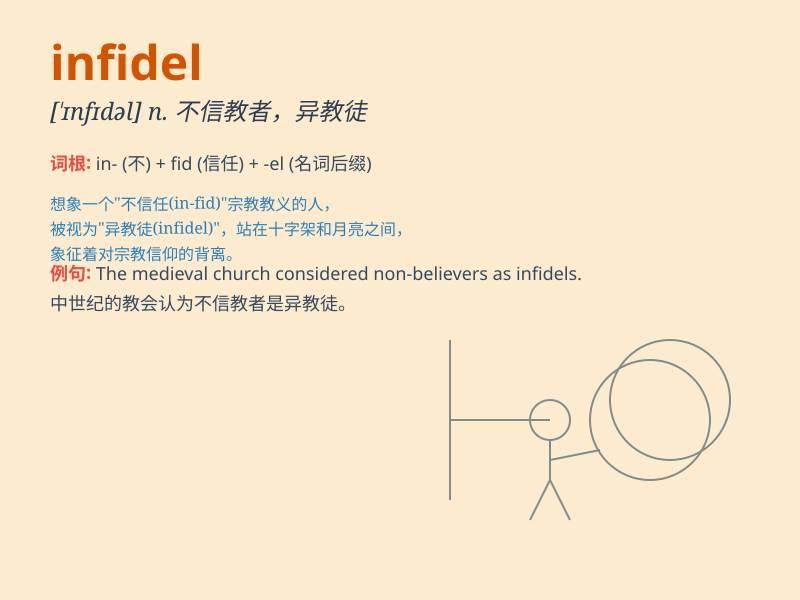

## infidel

**英音:** _[\'ɪnfɪd(ə)l]_ **美音:** _[\'ɪnfədl]_

**译义:** *adj.不信宗教的,异端的n.无信仰者,异教徒,异端*

### 短语

+ **infidel belief:** _异教信仰_

+ **infidel invaders:** _异教侵略者_

+ **infidel lands:** _异教地区_

+ **infidel customs:** _异教习俗_

+ **infidel ideology:** _异教思想_

### 例句

#### 例句1

> **The infidel was shunned by the religious community.**

**中文翻译:** 异教徒受到宗教界的排斥。

**单词释义:** 不信教者；异教徒

#### 例句2

> **He accused his opponent of being an infidel to the cause.**

**中文翻译:** 他指责他的对手是这一事业的异教徒。

**单词释义:** 不忠诚的人；背信者

#### 例句3

> **In the old days, infidels were often persecuted.**

**中文翻译:** 在过去，异教徒经常受到迫害。

**单词释义:** 异教徒；不信教者

### 背诵小故事

> A brave knight was on a quest. He met a mysterious person called
\'Infidel\' who didn\'t believe in the power of the sacred sword. But
the knight showed him the truth and made him change his mind.

**一位勇敢的骑士在执行任务。他遇到了一个叫'异教徒'的神秘人，此人不相信神圣之剑的力量。但骑士向他展示了真相，让他改变了想法。**

### 图义

