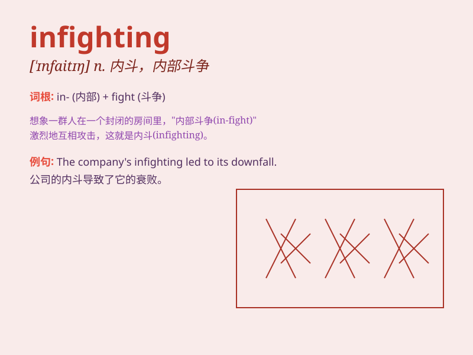

## infighting

**英音:** _[\'ɪnfaɪtɪŋ]_ **美音:** _[\'ɪnfaɪtɪŋ]_

**译义:** *n.接近战,混战,暗斗*

### 短语

+ **political infighting:** _政治内斗_

+ **corporate infighting:** _公司内部争斗_

+ **intense infighting:** _激烈的内部争斗_

+ **endless infighting:** _无休止的内斗_

+ **family infighting:** _家庭内部纷争_

### 例句

#### 例句1

> **There was a lot of infighting within the political party.**

**中文翻译:** 政党内部存在很多内讧。

**单词释义:** 内部争斗；内讧

#### 例句2

> **The company suffered from infighting among its top managers.**

**中文翻译:** 该公司的高层管理人员之间存在内讧。

**单词释义:** 内部纷争；内部斗争

#### 例句3

> **The team\'s success was hindered by infighting between the
players.**

**中文翻译:** 球队的成功因球员之间的内讧而受到阻碍。

**单词释义:** 内部的争斗；内部冲突

### 背诵小故事

> In a big company, there was a lot of infighting among different
teams. They were all competing for limited resources and power. It was a
mess. But finally, they realized unity was important.

**在一家大公司里，不同团队之间有很多内斗。他们都在争夺有限的资源和权力，一片混乱。但最后，他们意识到团结很重要。**

### 图义

