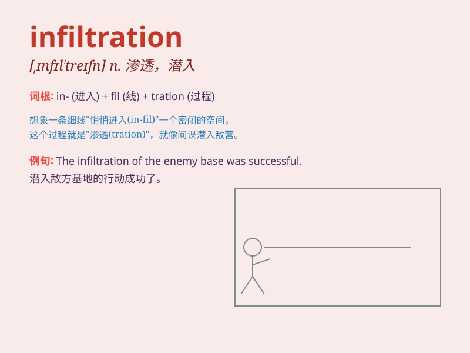

## infiltration

**英音:** _[,ɪnfɪl\'treɪʃən]_ **美音:**
_[,ɪnfɪl\'treʃən]_

**译义:** *n.渗透*

### 短语

+ **infiltration rate:** _渗透率；渗滤率；入渗率_

+ **infiltration capacity:** _渗透能力；入渗容量_

+ **infiltration process:** _渗透过程；入渗过程_

+ **groundwater infiltration:** _地下水入渗_

+ **infiltration front:** _入渗锋面；渗透前沿_

### 例句

#### 例句1

> **The infiltration of enemy spies was detected in time.**

**中文翻译:** 敌方间谍的渗透被及时发现。

**单词释义:** 渗透；潜入

#### 例句2

> **The rain caused infiltration into the basement.**

**中文翻译:** 雨水渗入地下室。

**单词释义:** 渗入；渗透

#### 例句3

> **The company is worried about the infiltration of competitors\'
products into their market.**

**中文翻译:** 该公司担心竞争对手的产品渗透到他们的市场。

**单词释义:** 渗入；侵入

### 背诵小故事

> A spy was sent on a mission of infiltration. He had to sneak into the
enemy\'s base without being noticed. It was a risky but necessary task
to gather important information.

**一名间谍被派去执行渗透任务。他必须在不被注意的情况下潜入敌人的基地。这是一项冒险但必要的任务，以收集重要信息。**

### 图义

