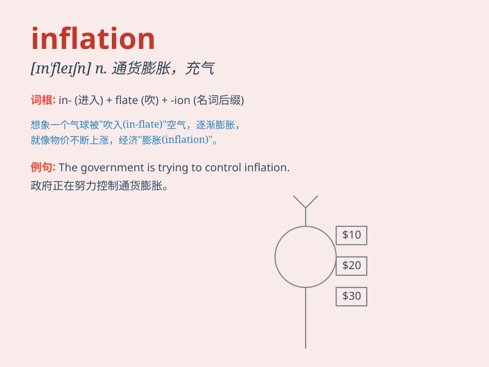

## inflation

**英音:** _[ɪn\'fleɪʃ(ə)n]_ **美音:** _[ɪn\'fleʃən]_

**译义:** *n.胀大,夸张,通货膨胀,(物价)暴涨*

### 短语

+ **inflation rate:** _通货膨胀率_

+ **runaway inflation:** _恶性通货膨胀_

+ **inflation pressure:** _通货膨胀压力_

+ **low inflation:** _低通货膨胀_

+ **control inflation:** _控制通货膨胀_

### 例句

#### 例句1

> **The government is taking measures to control inflation.**

**中文翻译:** 政府正在采取措施来控制通货膨胀。

**单词释义:** 通货膨胀

#### 例句2

> **High inflation has a negative impact on the economy.**

**中文翻译:** 高通货膨胀对经济有负面影响。

**单词释义:** 通货膨胀

#### 例句3

> **Inflation rates have been steadily rising this year.**

**中文翻译:** 今年通货膨胀率一直在稳步上升。

**单词释义:** 通货膨胀；通胀率

### 背诵小故事

> In a small town, prices kept rising. Everything from food to clothes
became more expensive. This was inflation. People\'s money could buy
less and less. It was like a monster eating away at their savings.

**在一个小镇上，物价持续上涨。从食物到衣服，所有东西都变得更贵了。这就是通货膨胀。人们的钱能买到的东西越来越少。它就像一个怪物在吞噬他们的积蓄。**

### 图义

