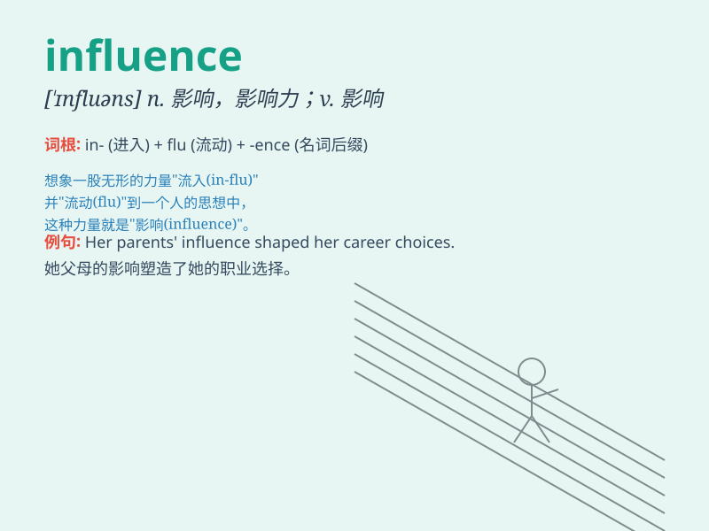

## influence

**英音:** _[\'ɪnflʊəns]_ **美音:** _[\'ɪnfluəns]_

**译义:**
*n.影响,感化,势力,有影响的人(或事),(电磁)感应vt.影响,改变*

### 短语

+ **exert influence:** _施加影响_

+ **under the influence:** _受\...影响；在\...影响之下_

+ **have influence on:** _对\...有影响_

+ **influence peddling:** _以权谋私；为私利施加影响_

+ **sphere of influence:** _势力范围；影响范围_

### 例句

#### 例句1

> **The influence of parents on their children is profound.**

**中文翻译:** 父母对孩子的影响是深远的。

**单词释义:** 影响

#### 例句2

> **She has a lot of influence in the fashion industry.**

**中文翻译:** 她在时尚界有很大的影响力。

**单词释义:** 影响力

#### 例句3

> **His words had no influence on her decision.**

**中文翻译:** 他的话对她的决定没有影响。

**单词释义:** 影响

### 背诵小故事

> Once upon a time, a wise old man had a great influence on the
villagers. His words and actions guided them to make better choices.
Just like his power, \'influence\' means the ability to affect or change
someone or something.

**从前，有一位睿智的老人对村民们有很大的影响力。他的言行引导他们做出更好的选择。就像他的力量一样，'influence'这个单词意思是影响或改变某人或某事的能力。**

### 图义

