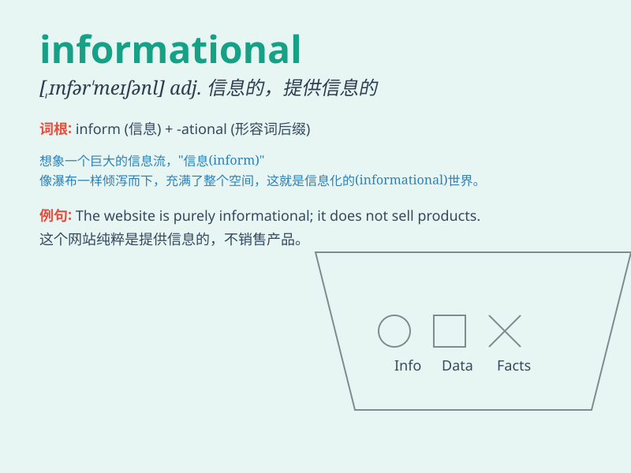

## informational

**英音:** _[ˌɪnfəˈmeɪʃənl]_ **美音:** _[ˌɪnfərˈmeɪʃənl]_

**译义:** *adj.报告的,情报的*

### 短语

+ **informational resources:** _信息资源_

+ **informational technology:** _信息技术_

+ **informational content:** _信息内容_

+ **informational system:** _信息系统_

+ **informational society:** _信息社会_

### 例句

#### 例句1

> **The website provides a wealth of informational resources on
various topics.**

**中文翻译:** 这个网站提供了大量关于各种主题的信息资源。

**单词释义:** 信息的；情报的

#### 例句2

> **We need to analyze the informational content of this report
carefully.**

**中文翻译:** 我们需要仔细分析这份报告的信息内容。

**单词释义:** 信息的；情报的

#### 例句3

> **The informational meeting was very helpful for the new
employees.**

**中文翻译:** 这次信息交流会对新员工非常有帮助。

**单词释义:** 信息的；提供信息的

### 背诵小故事

> One day, a little bird was carrying important informational messages.
It flew across mountains and rivers to inform its friends. The messages
helped them solve many problems. Remember, informational means providing
useful information.

**有一天，一只小鸟携带着重要的信息。它飞越山川河流去通知它的朋友们。这些信息帮助它们解决了许多问题。记住，informational
意思是提供有用的信息。**

### 图义

