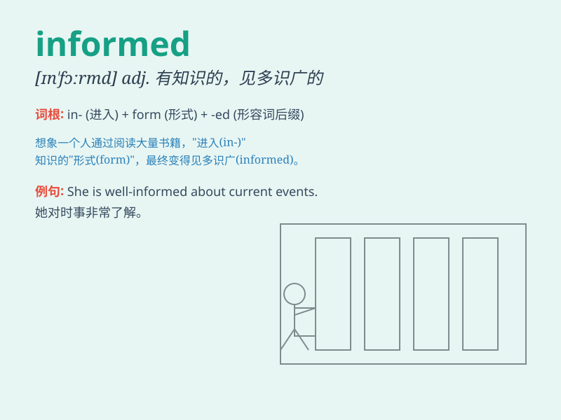

## informed

**英音:** _[ɪn\'fɔːmd]_ **美音:** _[ɪn\'fɔrmd]_

**译义:** *adj.见多识广的*

### 短语

+ **informed decision:** _明智的决定_

+ **informed consent:** _知情同意_

+ **informed source:** _消息灵通人士_

+ **well-informed:** _见多识广的；消息灵通的_

+ **keep someone informed:** _使某人随时了解情况_

### 例句

#### 例句1

> **She is always well informed about the latest news.**

**中文翻译:** 她总是对最新的新闻消息了如指掌。

**单词释义:** 见多识广的；消息灵通的

#### 例句2

> **We need to make an informed decision based on all the facts.**

**中文翻译:** 我们需要根据所有的事实做出明智的决定。

**单词释义:** 有根据的；明智的

#### 例句3

> **The doctor gave us an informed opinion on the treatment
options.**

**中文翻译:** 医生就治疗方案给了我们有见识的意见。

**单词释义:** 有见识的；有知识的

### 背诵小故事

> A detective was always informed about the latest criminal cases. He
got the informed tips from various sources and solved mysteries. Being
informed helped him do his job well.

**一位侦探总是知晓最新的刑事案件。他从各种渠道获得灵通的消息并解决谜团。消息灵通帮助他出色地完成工作。**

### 图义

