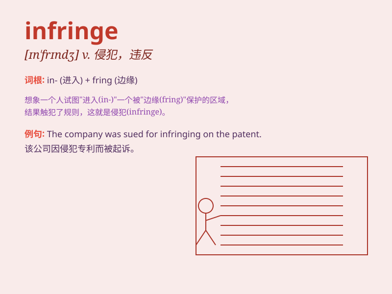

## infringe

**英音:** _[ɪn\'frɪn(d)ʒ]_ **美音:** _[ɪn\'frɪndʒ]_

**译义:** *v.破坏,侵犯,违反*

### 短语

+ **infringe upon:** _侵犯；侵害_

+ **infringe the law:** _违法；触犯法律_

+ **infringe a right:** _侵犯权利_

+ **infringe a patent:** _侵犯专利_

+ **infringe a copyright:** _侵犯版权_

### 例句

#### 例句1

> **The new law infringes on our basic rights.**

**中文翻译:** 新法律侵犯了我们的基本权利。

**单词释义:** 侵犯

#### 例句2

> **He was accused of infringing the company\'s patent.**

**中文翻译:** 他被指控侵犯了公司的专利。

**单词释义:** 侵犯；违反

#### 例句3

> **The actions of the protesters infringed the traffic
regulations.**

**中文翻译:** 抗议者的行为违反了交通规则。

**单词释义:** 违反

### 背诵小故事

> A man was trying to sell counterfeit goods, which infringed the
brand\'s copyright. The police came and stopped him, explaining that
such actions were against the law.

**一个男人试图出售假冒商品，这侵犯了品牌的版权。警察来了并制止了他，解释说这种行为是违法的。**

### 图义

