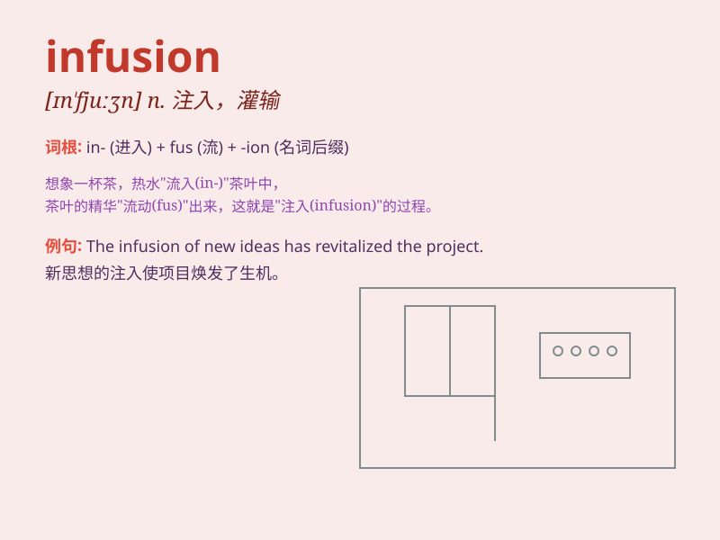

## infusion

**英音:** _[ɪn\'fjuːʒ(ə)n]_ **美音:** _[ɪn\'fjuʒn]_

**译义:** *n.灌输*

### 短语

+ **infusion therapy:** _输液疗法_

+ **infusion pump:** _输液泵_

+ **herbal infusion:** _草药浸液_

+ **coffee infusion:** _咖啡浸液_

+ **continuous infusion:** _持续输注_

### 例句

#### 例句1

> **The doctor prescribed an infusion to treat the patient\'s severe
infection.**

**中文翻译:** 医生开了输液处方来治疗病人的严重感染。

**单词释义:** 输液；注入

#### 例句2

> **The infusion of new ideas has revitalized the company.**

**中文翻译:** 新思想的注入使公司重新焕发了活力。

**单词释义:** 注入；灌输

#### 例句3

> **Her tea had a delicate infusion of herbs.**

**中文翻译:** 她的茶有一种淡淡的草药浸液。

**单词释义:** 浸液；泡制

### 背诵小故事

>
想象一下，在一个古老的药房里，药师正精心准备一种神奇的药水。他将各种珍贵的草药和精华慢慢倒入大锅中，这个缓慢倒入的过程就是\'infusion\'。药水最终充满了神奇的力量。

**想象在药房里，药师把草药精华慢慢倒入大锅的过程就是'注入，灌输'**

### 图义

