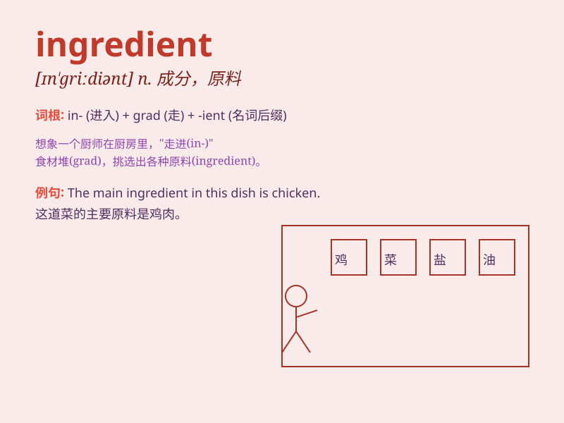

## ingredient

**英音:** _[ɪn\'griːdɪənt]_ **美音:** _[ɪn\'ɡridɪənt]_

**译义:** *n.成分,因素*

### 短语

+ **key ingredient:** _关键成分_

+ **active ingredient:** _活性成分_

+ **essential ingredient:** _基本成分；必要成分_

+ **main ingredient:** _主要成分_

+ **raw ingredient:** _原材料；未加工的成分_

### 例句

#### 例句1

> **Mix all the ingredients together in a bowl.**

**中文翻译:** 把所有的配料在一个碗里混合在一起。

**单词释义:** 配料；成分

#### 例句2

> **The main ingredient of this dish is chicken.**

**中文翻译:** 这道菜的主要成分是鸡肉。

**单词释义:** 成分；要素

#### 例句3

> **She carefully selected the ingredients for the cake.**

**中文翻译:** 她仔细挑选了做蛋糕的配料。

**单词释义:** 配料；原料

### 背诵小故事

>
想象一下，你正在做一个超级美味的蛋糕。面粉、鸡蛋、糖、牛奶等都是必不可少的，它们就是制作蛋糕的'ingredient'（成分、原料）。缺少任何一种，蛋糕都不会完美。

**想象你在做蛋糕，面粉、鸡蛋等是必不可少的成分、原料，缺少任何一种蛋糕都不完美。**

### 图义

