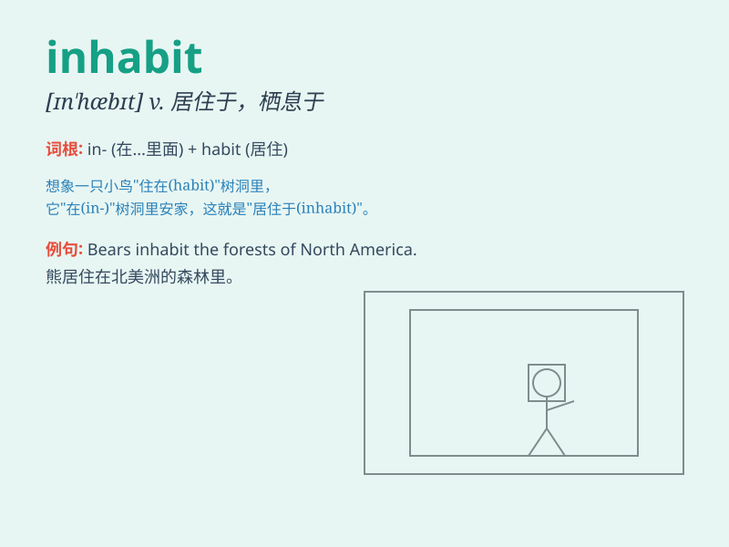

## inhabit

**英音:** _[ɪn\'hæbɪt]_ **美音:** _[ɪn\'hæbɪt]_

**译义:** *vt.居住于,存在于,占据,栖息*

### 短语

+ **inhabit an area:** _居住在一个地区_

+ **inhabit a forest:** _栖息在一片森林_

+ **inhabit a cave:** _居住在一个洞穴_

+ **inhabit a planet:** _居住在一个星球_

+ **inhabit a house:** _居住在一所房子里_

### 例句

#### 例句1

> **The island is inhabited by a few families.**

**中文翻译:** 这个岛屿被几个家庭居住着。

**单词释义:** 居住于；栖息于

#### 例句2

> **Fish inhabit the sea.**

**中文翻译:** 鱼栖息在海里。

**单词释义:** 栖息；生活于

#### 例句3

> **Wild animals still inhabit the forest.**

**中文翻译:** 野生动物仍然栖息在这片森林里。

**单词释义:** 栖息；占据

### 背诵小故事

>
想象一下，有一个神秘的岛屿，岛上风景优美。但起初无人居住，直到有一天，一群勇敢的探险家来到这里，决定在这里安家，他们就inhabit（居住）了这个岛屿。

**想象有个神秘岛屿起初无人居住，后来一群探险家决定在此安家即居住**

### 图义

