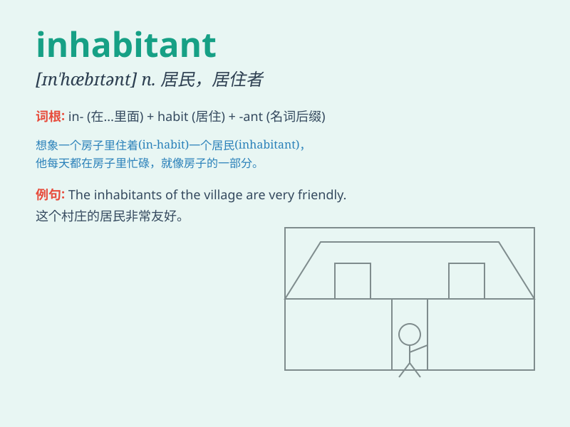

## inhabitant

**英音:** _[ɪn\'hæbɪt(ə)nt]_ **美音:** _[ɪn\'hæbɪtənt]_

**译义:** *n.居民,居住者*

### 短语

+ **local inhabitant:** _当地居民_

+ **urban inhabitant:** _城市居民_

+ **rural inhabitant:** _农村居民_

+ **native inhabitant:** _原住民；土著居民_

+ **long-time inhabitant:** _长期居民_

### 例句

#### 例句1

> **The island has only a few thousand inhabitants.**

**中文翻译:** 该岛只有几千名居民。

**单词释义:** 居民

#### 例句2

> **The ancient town is home to many friendly inhabitants.**

**中文翻译:** 这座古镇是许多友好居民的家园。

**单词释义:** 居民

#### 例句3

> **The new policy will affect the lives of the local
inhabitants.**

**中文翻译:** 新政策将影响当地居民的生活。

**单词释义:** 居民

### 背诵小故事

> In a faraway land, there was a beautiful village. Every house was
full of joy. The people living there were the inhabitants. They worked
together, celebrated together, and made the village a wonderful place to
be.

**在一个遥远的地方，有一个美丽的村庄。每座房子都充满欢乐。住在那里的人们就是居民。他们一起劳作，一起庆祝，让这个村庄成为美好的所在。**

### 图义

