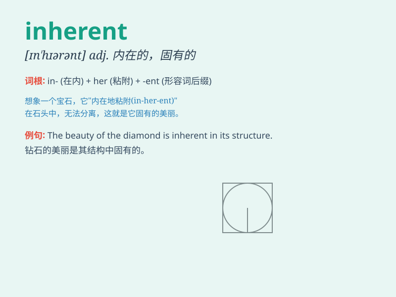

## inherent

**英音:** _[ɪn\'hɪər(ə)nt; -\'her(ə)nt]_ **美音:**
_[ɪn\'hɪrənt]_

**译义:** *adj.固有的,内在的,与生俱来的*

### 短语

+ **inherent defect:** _固有缺陷_

+ **inherent risk:** _内在风险_

+ **inherent quality:** _固有品质_

+ **inherent nature:** _固有性质_

+ **inherent property:** _固有属性_

### 例句

#### 例句1

> **The inherent beauty of nature is breathtaking.**

**中文翻译:** 大自然与生俱来的美丽令人叹为观止。

**单词释义:** 固有的

#### 例句2

> **There is an inherent risk in this investment.**

**中文翻译:** 这项投资存在固有风险。

**单词释义:** 内在的

#### 例句3

> **His inherent kindness made him popular among his friends.**

**中文翻译:** 他与生俱来的善良使他在朋友中很受欢迎。

**单词释义:** 天生的

### 背诵小故事

> Imagine a special gemstone that has a beautiful color INHERENT within
it. This color can\'t be removed or changed because it\'s a part of the
gem\'s nature. Just like that, \'inherent\' means existing as a natural
or permanent part of something.

**想象一块特殊的宝石，其内部有一种美丽的颜色是固有的。这种颜色无法去除或改变，因为它是宝石本质的一部分。就像这样，'inherent'意思是作为某物自然或永久的一部分而存在。**

### 图义

