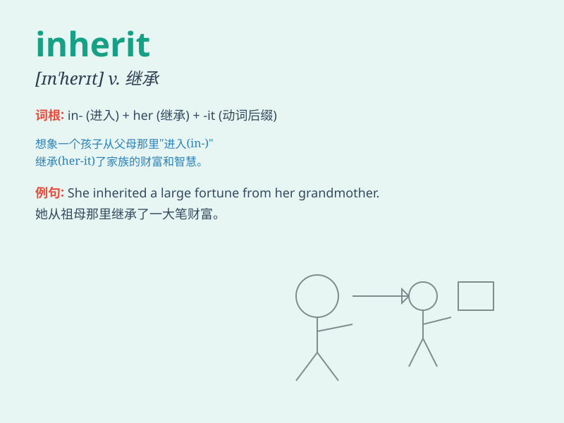

## inherit

**英音:** _[ɪn\'herɪt]_ **美音:** _[ɪn\'hɛrɪt]_

**译义:** *vt.继承,遗传而得*

### 短语

+ **inherit a fortune:** _继承一笔财富_

+ **inherit a title:** _继承一个头衔_

+ **inherit a trait:** _遗传一种特质_

+ **inherit a debt:** _继承债务_

+ **inherit a tradition:** _继承传统_

### 例句

#### 例句1

> **He inherited a large fortune from his uncle.**

**中文翻译:** 他从叔叔那里继承了一大笔财产。

**单词释义:** 继承（财产等）

#### 例句2

> **She inherited her mother\'s good looks.**

**中文翻译:** 她继承了母亲的美貌。

**单词释义:** 遗传（容貌、性格等）

#### 例句3

> **The new manager inherited a team in disarray.**

**中文翻译:** 新任经理接手的团队一片混乱。

**单词释义:** 接手（处于某种状态的事物）

### 背诵小故事

> A prince was very worried because he had to inherit the huge kingdom
from his father. But with hard work and wisdom, he finally managed to
inherit it successfully and made the kingdom prosperous.

**一位王子非常担忧，因为他得从父亲那里继承庞大的王国。但通过努力和智慧，他最终成功继承了它，并让王国繁荣起来。**

### 图义

