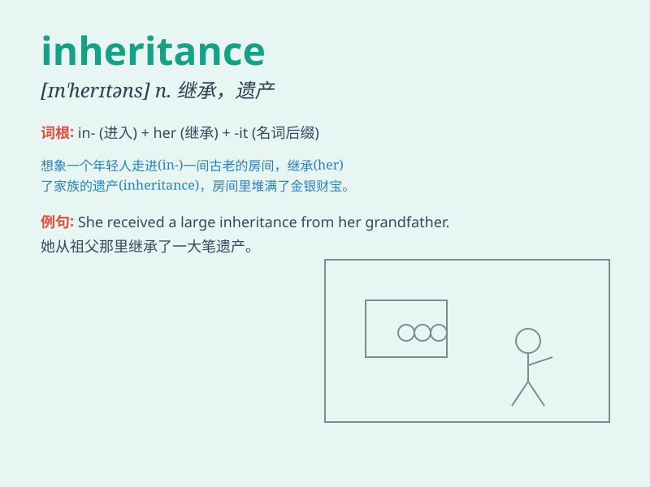

## inheritance

**英音:** _[ɪn\'herɪt(ə)ns]_ **美音:** _[ɪn\'hɛrɪtəns]_

**译义:** *n.遗传,遗产*

### 短语

+ **inheritance tax:** _遗产税_

+ **inheritance law:** _继承法_

+ **inheritance rights:** _继承权_

+ **inheritance dispute:** _遗产纠纷_

+ **inheritance pattern:** _遗传模式_

### 例句

#### 例句1

> **She received a large inheritance from her grandfather.**

**中文翻译:** 她从祖父那里继承了一大笔遗产。

**单词释义:** 遗产

#### 例句2

> **The inheritance of genetic traits is a complex process.**

**中文翻译:** 遗传性状的遗传是一个复杂的过程。

**单词释义:** 遗传；传承

#### 例句3

> **His inheritance of the family business came with great
responsibility.**

**中文翻译:** 他继承家族企业的同时也肩负着巨大的责任。

**单词释义:** 继承

### 背诵小故事

> A prince was excited as he knew he would get an inheritance of a huge
castle and vast land from his father. But he had to prove himself
worthy. Finally, he received the precious inheritance and took good care
of it.

**一位王子很兴奋，因为他知道自己将从父亲那里继承一座巨大的城堡和广阔的土地。但他必须证明自己配得上。最终，他得到了这份珍贵的遗产，并妥善管理。**

### 图义

