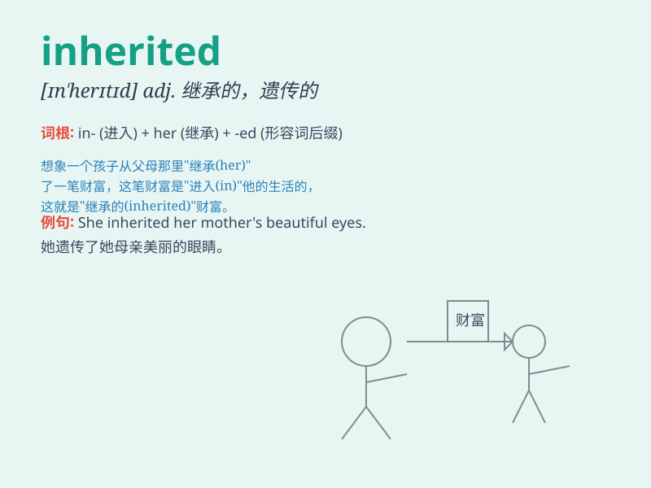

## inherited

**英音:** _[ɪn\'herɪtɪd]_ **美音:** _[ɪn\'hɛrɪtid]_

**译义:** *adj.通过继承得到的,遗传的 继承权的*

### 短语

+ **inherited defect:** _遗传缺陷_

+ **inherited trait:** _遗传性状_

+ **inherited wealth:** _继承的财富_

+ **inherited disease:** _遗传病_

+ **inherited property:** _继承的财产_

### 例句

#### 例句1

> **She inherited a large fortune from her grandparents.**

**中文翻译:** 她从祖父母那里继承了一大笔财产。

**单词释义:** 继承

#### 例句2

> **He inherited his father\'s bad temper.**

**中文翻译:** 他遗传了父亲的坏脾气。

**单词释义:** 遗传

#### 例句3

> **The new house inherited some problems from the previous
owner.**

**中文翻译:** 新房子继承了前房主的一些问题。

**单词释义:** 承接；接手

### 背诵小故事

> A prince inherited a huge castle from his father. But with it came
many responsibilities. He needed to protect and manage it well.
Remember, \'inherited\' means received something from someone who has
died.

**一位王子从他父亲那里继承了一座巨大的城堡。但随之而来的是许多责任。他需要好好地保护和管理它。记住，\'inherited\'意思是从已去世的人那里得到某物。**

### 图义

