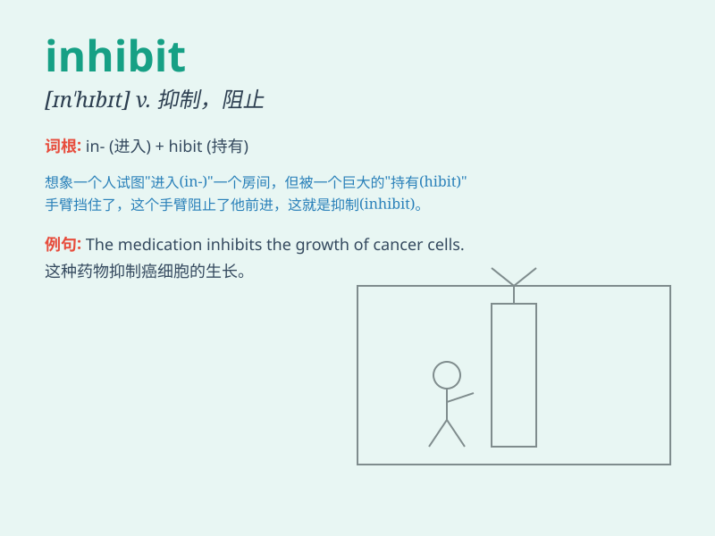

## inhibit

**英音:** _[ɪn\'hɪbɪt]_ **美音:** _[ɪn\'hɪbɪt]_

**译义:** * 抑制,约束,[化][医]抑制*

### 短语

+ **inhibit growth:** _抑制生长_

+ **inhibit development:** _阻碍发展_

+ **inhibit behavior:** _抑制行为_

+ **inhibit emotion:** _抑制情感_

+ **inhibit reaction:** _抑制反应_

### 例句

#### 例句1

> **The high cost inhibits the widespread use of this technology.**

**中文翻译:** 高昂的成本限制了该技术的广泛应用。

**单词释义:** 阻止；抑制

#### 例句2

> **Alcohol can inhibit your ability to drive safely.**

**中文翻译:** 酒精会抑制您安全驾驶的能力。

**单词释义:** 妨碍；抑制

#### 例句3

> **Fear often inhibits people from taking risks.**

**中文翻译:** 恐惧常常阻止人们冒险。

**单词释义:** 抑制；约束

### 背诵小故事

> Imagine a scientist in a lab. He has a special potion that can
inhibit the growth of a strange plant. Every time he uses it, the plant
stops growing rapidly. So, \'inhibit\' means to prevent or stop
something from happening or developing.

**想象一位科学家在实验室里。他有一种特殊的药水，可以抑制一种奇怪植物的生长。每次他使用它，植物就停止快速生长。所以，'inhibit'意思是阻止或防止某事发生或发展。**

### 图义

