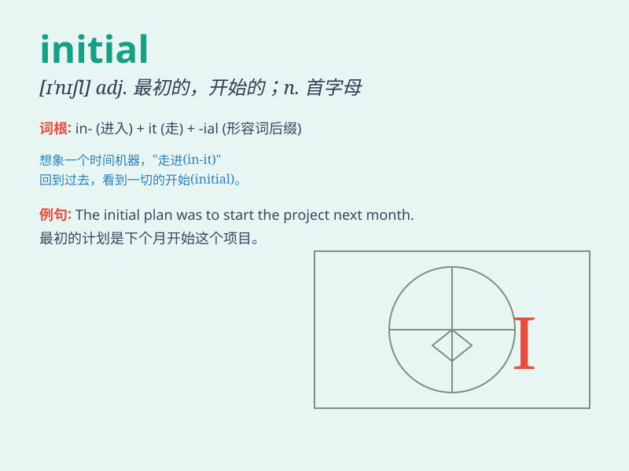

## initial

**英音:** _[ɪ\'nɪʃəl]_ **美音:** _[ɪ\'nɪʃəl]_

**译义:** *adj.最初的,词首的,初始的n.词首大写字母*

### 短语

+ **initial stage:** _初始阶段_

+ **initial investment:** _初始投资_

+ **initial public offering:** _首次公开募股_

+ **initial reaction:** _最初的反应_

+ **initial attempt:** _初步尝试_

### 例句

#### 例句1

> **The initial reaction to the news was one of shock.**

**中文翻译:** 听到这个消息的第一反应是震惊。

**单词释义:** 最初的

#### 例句2

> **My initial plan was to travel alone.**

**中文翻译:** 我最初的计划是一个人去旅行。

**单词释义:** 最初的

#### 例句3

> **The initial stage of the project was very difficult.**

**中文翻译:** 项目的初期阶段非常困难。

**单词释义:** 初始的

### 背诵小故事

> A young artist was about to create his initial masterpiece. He took
the first brushstroke with great care, knowing it was the initial step
to his success. The initial inspiration came from a beautiful sunset.

**一位年轻的艺术家即将创作他的初始杰作。他小心翼翼地画下第一笔，深知这是他成功的初始步骤。初始的灵感来自于一次美丽的日落。**

### 图义

