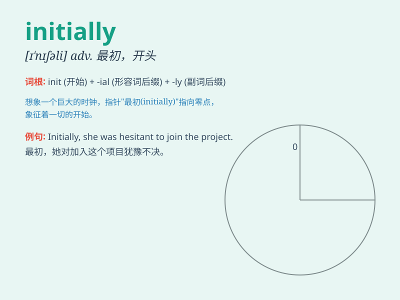

## initially

**英音:** _[ɪ\'nɪʃ(ə)lɪ]_ **美音:** _[ɪ\'nɪʃəli]_

**译义:** *adv.最初,开头*

### 短语

+ **initially thought:** _最初认为_

+ **initially planned:** _最初计划_

+ **initially proposed:** _最初提议_

+ **initially expected:** _最初预期_

+ **initially designed:** _最初设计_

### 例句

#### 例句1

> **Initially, I thought the plan was feasible.**

**中文翻译:** 起初，我认为这个计划是可行的。

**单词释义:** 起初；开始

#### 例句2

> **The project was initially estimated to cost \$10 million.**

**中文翻译:** 该项目最初估计耗资1000万美元。

**单词释义:** 最初

#### 例句3

> **Initially, she was reluctant to take on the new role, but
eventually she agreed.**

**中文翻译:** 起初，她不愿意接受这个新角色，但最终她同意了。

**单词释义:** 最初

### 背诵小故事

> A young artist initially struggled to find his style. But with
perseverance, he finally discovered it and became famous. \'Initially\'
here means at the beginning, showing the start of a process.

**一位年轻的艺术家起初很难找到自己的风格。但凭借毅力，他最终找到了并成名。'initially'在这里指的是在开始的时候，表明一个过程的开端。**

### 图义

