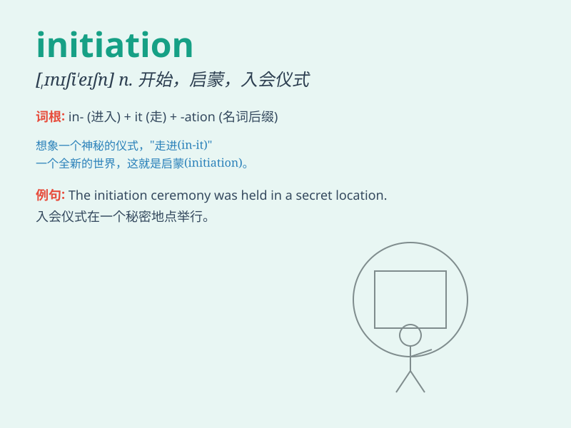

## initiation

**英音:** _[ɪ,nɪʃɪ\'eɪʃn]_ **美音:** _[ɪ,nɪʃɪ\'eʃən]_

**译义:** *n.开始*

### 短语

+ **initiation ceremony:** _入会仪式；启动仪式_

+ **initiation process:** _启动过程；开始流程_

+ **initiation stage:** _起始阶段；初始阶段_

+ **initiation fee:** _入会费；启动费用_

+ **initiation into:** _引入；开始进入_

### 例句

#### 例句1

> **The initiation of the project was delayed due to unforeseen
circumstances.**

**中文翻译:** 由于不可预见的情况，该项目的启动被推迟。

**单词释义:** 开始；发起

#### 例句2

> **She underwent an initiation ceremony to become a member of the
club.**

**中文翻译:** 她参加了入会仪式，成为俱乐部的一员。

**单词释义:** 入会（仪式）

#### 例句3

> **The initiation of the new policy has brought about positive
changes.**

**中文翻译:** 新政策的出台带来了积极的变化。

**单词释义:** 推行；实施

### 背诵小故事

> A young adventurer was chosen for an initiation into a secret
society. He had to pass many difficult tests. The initiation was a
challenging but rewarding journey that changed his life.

**一位年轻的冒险家被选中参加一个秘密社团的入会仪式。他必须通过许多艰难的考验。这次入会是一次充满挑战但有收获的旅程，改变了他的人生。**

### 图义

