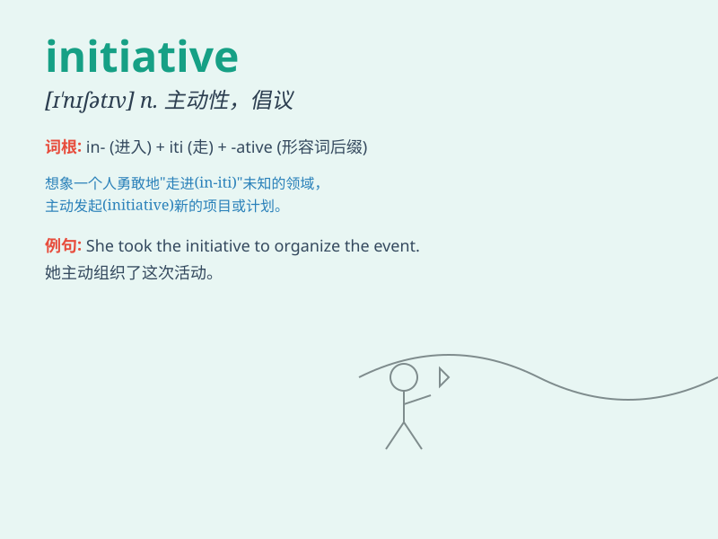

## initiative

**英音:** _[ɪ\'nɪʃɪətɪv; -ʃə-]_ **美音:** _[ɪ\'nɪʃətɪv]_

**译义:** *n.主动*

### 短语

+ **take the initiative:** _采取主动；带头_

+ **on one\'s own initiative:** _主动地；自发地_

+ **show initiative:** _表现出主动性_

+ **have the initiative:** _掌握主动_

+ **initiative spirit:** _进取精神_

### 例句

#### 例句1

> **She took the initiative to organize the charity event.**

**中文翻译:** 她主动组织了这次慈善活动。

**单词释义:** 主动行动；主动性

#### 例句2

> **The government\'s initiative to improve education has received
widespread support.**

**中文翻译:** 政府改善教育的举措得到了广泛支持。

**单词释义:** 倡议；新方案

#### 例句3

> **It\'s up to you to show initiative and solve the problem.**

**中文翻译:** 这取决于你是否表现出主动性并解决问题。

**单词释义:** 主动性；积极性

### 背诵小故事

> A young man took the initiative to organize a community cleanup. No
one asked him to do it; he just decided to act. His bold move made the
neighborhood cleaner and more beautiful.

**一个年轻人主动组织了一次社区清理活动。没有人要求他这么做，他只是决定行动起来。他的大胆举动让社区变得更干净、更美丽。**

### 图义

