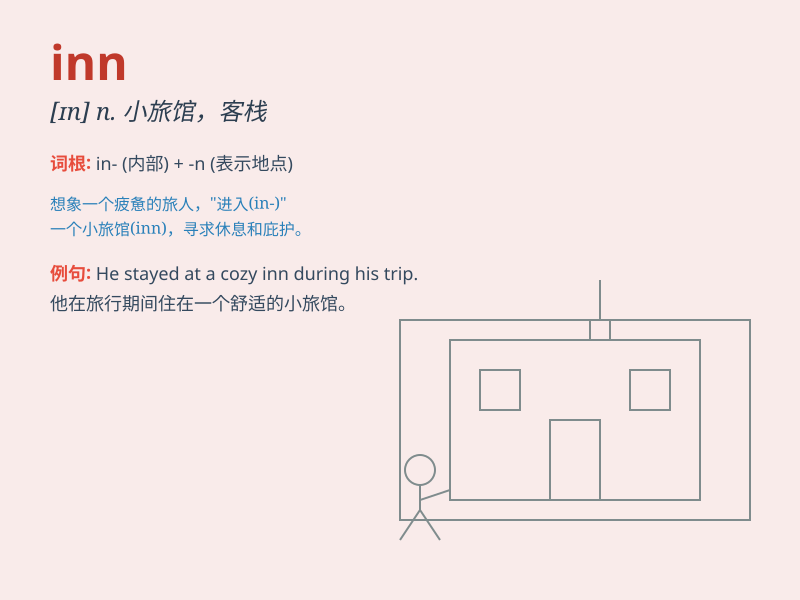

## inn

**英音:** _[ɪn]_ **美音:** _[ɪn]_

**译义:** *n.(尤指乡村或公路边的) 旅馆,客栈vi.住旅馆*

### 短语

+ **inn keeper:** _客栈老板_

+ **country inn:** _乡村旅馆_

+ **roadside inn:** _路边客栈_

+ **inn sign:** _客栈招牌_

+ **inn room:** _客栈房间_

### 例句

#### 例句1

> **We spent the night at a charming inn in the countryside.**

**中文翻译:** 我们在乡村一家迷人的旅馆过夜。

**单词释义:** 小客栈；小旅馆

#### 例句2

> **The old inn was full of character.**

**中文翻译:** 老客栈很有特色。

**单词释义:** 小客栈；小旅馆

#### 例句3

> **He stopped at the inn for a meal and a rest.**

**中文翻译:** 他在客栈停下来吃了一顿饭，休息了一会儿。

**单词释义:** 小客栈；小旅馆

### 背诵小故事

> A traveler was very tired on the journey. Fortunately, he found an
INN. There was a warm bed and delicious food. He had a good rest and
regained energy.

**一位旅行者在旅途中非常疲惫。幸运的是，他找到了一家小旅馆。那里有温暖的床和美味的食物。他好好休息了一番，恢复了精力。**

### 图义

