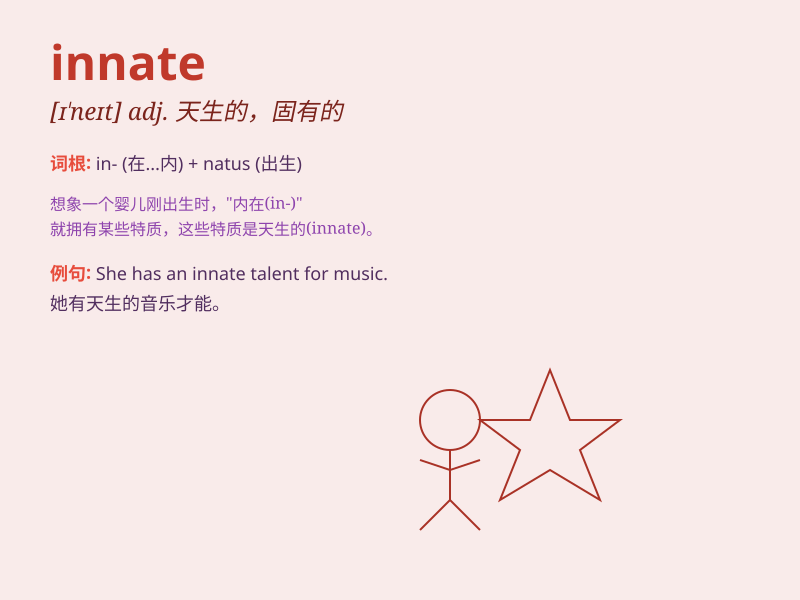

## innate

**英音:** _[ɪ\'neɪt; \'ɪneɪt]_ **美音:** _[ɪ\'net]_

**译义:** *adj.先天的,天生的*

### 短语

+ **innate ability:** _天生的能力_

+ **innate quality:** _天生的品质_

+ **innate immunity:** _先天免疫_

+ **innate knowledge:** _先天知识_

+ **innate nature:** _天生的本性_

### 例句

#### 例句1

> **She has an innate talent for music.**

**中文翻译:** 她有着与生俱来的音乐天赋。

**单词释义:** 天生的；与生俱来的

#### 例句2

> **His innate kindness made him popular among his friends.**

**中文翻译:** 他与生俱来的善良使他在朋友中很受欢迎。

**单词释义:** 天生的；固有的

#### 例句3

> **The baby has an innate ability to recognize her mother\'s
voice.**

**中文翻译:** 婴儿有一种天生的能力来识别母亲的声音。

**单词释义:** 天生的；先天的

### 背诵小故事

> Imagine a baby born with an innate ability to smile charmingly. No
one taught the baby; it just came naturally. This natural ability is
like what \'innate\' means - existing from birth, natural and inborn.

**想象一个婴儿生来就具有迷人微笑的能力。没有人教这个婴儿；它就是自然而然的。这种天生的能力就像'innate'的意思------生来就有、天生的、固有的。**

### 图义

