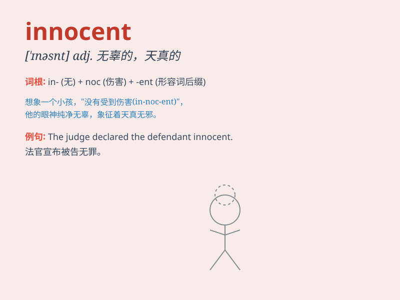

## innocent

**英音:** _[\'ɪnəs(ə)nt]_ **美音:** _[\'ɪnəsnt]_

**译义:** *adj.(～ of) 清白的,无罪的,天真的,无知的*

### 短语

+ **innocent victim:** _无辜的受害者_

+ **innocent smile:** _天真无邪的微笑_

+ **innocent child:** _天真的孩子_

+ **proclaim one\'s innocence:** _宣称自己无罪_

+ **presumed innocent:** _假定无罪_

### 例句

#### 例句1

> **She has an innocent smile.**

**中文翻译:** 她有着天真的笑容。

**单词释义:** 天真无邪的

#### 例句2

> **The accused was proved innocent of the crime.**

**中文翻译:** 被告被证明无罪。

**单词释义:** 无罪的；清白的

#### 例句3

> **He is too innocent to understand such a complex issue.**

**中文翻译:** 他太天真了，无法理解这么复杂的问题。

**单词释义:** 天真的；单纯的

### 背诵小故事

> A little girl was wrongly accused of stealing a candy. But she was
innocent. Everyone believed she was the thief except her best friend.
Finally, the truth came out and she was proved innocent.

**一个小女孩被错误地指控偷了一颗糖果。但她是无辜的。除了她最好的朋友，每个人都认为她是小偷。最后，真相大白，她被证明是无辜的。**

### 图义

