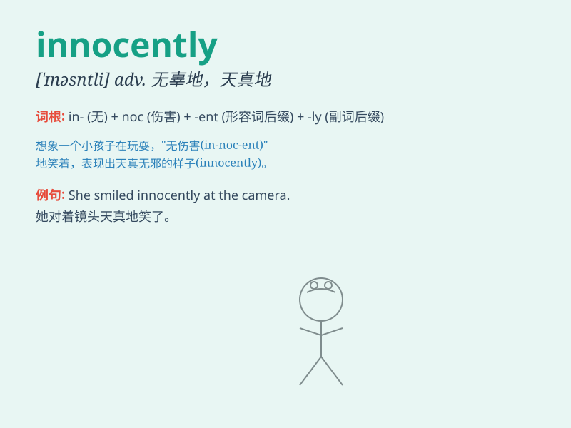

## innocently

**英音:** _[ˈɪnəsntli]_ **美音:** _[ˈɪnəsntli]_

**译义:** *adv.无罪地,纯洁地*

### 短语

+ **innocently smile:** _天真地微笑_

+ **innocently ask:** _天真地问_

+ **act innocently:** _表现得天真无邪_

+ **look innocently:** _看起来天真无邪_

+ **speak innocently:** _天真地说_

### 例句

#### 例句1

> **She smiled innocently at the judge.**

**中文翻译:** 她对法官天真地笑了笑。

**单词释义:** 天真无邪地

#### 例句2

> **He innocently asked why they were leaving.**

**中文翻译:** 他天真地问他们为什么要走。

**单词释义:** 天真地

#### 例句3

> **The child looked at me innocently.**

**中文翻译:** 孩子天真地看着我。

**单词释义:** 天真地

### 背诵小故事

> A little girl was walking in the park innocently. Suddenly, a bird
landed on her shoulder. She smiled, not knowing that a surprise party
was waiting for her at home. She was just being pure and naïve.

**一个小女孩天真无邪地在公园里走着。突然，一只鸟落在她的肩上。她微笑着，不知道家里正有一个惊喜派对等着她。她就是那么纯真、无邪。**

### 图义

