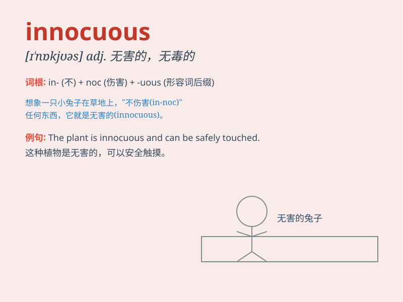

## innocuous

**英音:** _[ɪ\'nɒkjʊəs]_ **美音:** _[ɪ\'nɑkjuəs]_

**译义:** *adj.无害的,无毒的,无伤大雅的,不得罪人的*

### 短语

+ **innocuous remark:** _无害的言论_

+ **innocuous substance:** _无害物质_

+ **innocuous question:** _无害的问题_

+ **innocuous behavior:** _无害的行为_

+ **innocuous activity:** _无害的活动_

### 例句

#### 例句1

> **The comment seemed innocuous, but it caused a lot of
controversy.**

**中文翻译:** 这条评论看似无伤大雅，却引起了很大争议。

**单词释义:** 无害的

#### 例句2

> **The medicine has an innocuous side effect.**

**中文翻译:** 该药具有无害的副作用。

**单词释义:** 无害的

#### 例句3

> **The question was innocuous enough, but her reaction was
strange.**

**中文翻译:** 这个问题本身没什么问题，但她的反应却很奇怪。

**单词释义:** 无害的

### 背诵小故事

> A little rabbit was exploring a new forest. It met many strange
things but all were innocuous. Like colorful flowers that just smelled
nice and soft grass that was pleasant to touch. The rabbit had a safe
and peaceful adventure.

**一只小兔子正在探索一片新森林。它遇到了很多奇怪的东西，但都无害。像只是闻起来很香的彩色花朵和摸起来很舒服的柔软草地。小兔子有了一场安全又平静的冒险。**

### 图义

