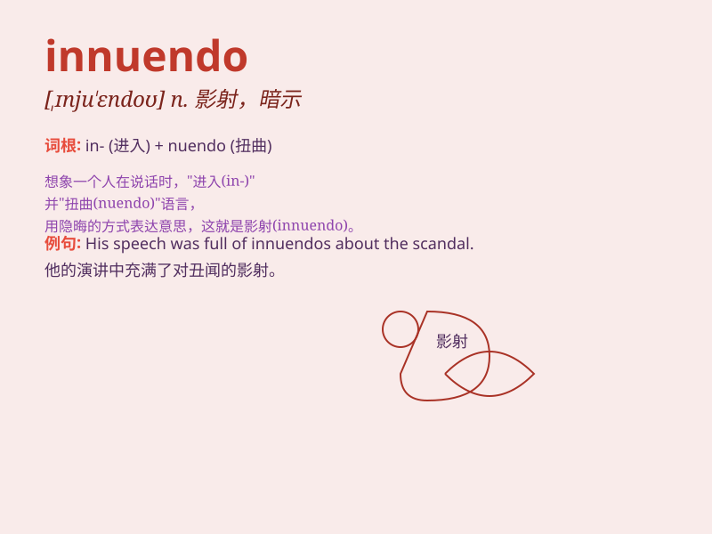

## innuendo

**英音:** _[,ɪnjʊ\'endəʊ]_ **美音:** _[,ɪnju\'ɛndo]_

**译义:** *n.暗讽(的话),影射(的话)vi.影射vt.旁敲侧击地表达,暗示*

### 短语

+ **veiled innuendo:** _含蓄的影射_

+ **malicious innuendo:** _恶意的影射_

+ **subtle innuendo:** _微妙的影射_

+ **sexual innuendo:** _性暗示_

+ **throw innuendoes at:** _对\...\...进行影射_

### 例句

#### 例句1

> **His remarks were filled with innuendo that suggested something
improper.**

**中文翻译:** 他的言论充满了暗示，暗示着一些不正当的事情。

**单词释义:** 影射；暗讽；含沙射影的话

#### 例句2

> **The article was full of innuendo about the politician\'s private
life.**

**中文翻译:** 这篇文章充满了对这位政客私生活的影射。

**单词释义:** 影射；暗示

#### 例句3

> **She made an innuendo that I was cheating, but she had no
proof.**

**中文翻译:** 她影射我出轨，但她没有证据。

**单词释义:** 含沙射影；暗指

### 背诵小故事

> 在一场神秘的聚会中，有人总是用隐晦的话语 innuendo
暗示着某个秘密。大家都努力猜测他话中的深意，却始终无法确定。最后才发现，这是个精心设计的谜团。

**在一场聚会中，有人总用含沙射影的话语暗示秘密，大家努力猜测却无法确定，这就是【innuendo】（暗讽，影射）**

### 图义

