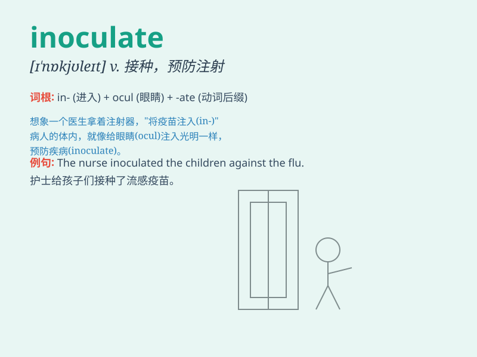

## inoculate

**英音:** _[ɪ\'nɒkjʊleɪt]_ **美音:** _[ɪ\'nɑkjə\'let]_

**译义:** *vt.接种,嫁接*

### 短语

+ **inoculate against:** _预防；接种以防_

+ **inoculate with:** _用\...\...接种_

+ **inoculate seedlings:** _给幼苗接种_

+ **inoculate animals:** _给动物接种_

+ **inoculate plants:** _给植物接种_

### 例句

#### 例句1

> **The doctor inoculated the children against polio.**

**中文翻译:** 医生给孩子们接种了小儿麻痹症疫苗。

**单词释义:** 给\...接种疫苗

#### 例句2

> **Farmers inoculate their cattle to prevent disease.**

**中文翻译:** 农民给牛接种疫苗以预防疾病。

**单词释义:** 给\...接种

#### 例句3

> **She was inoculated with the new flu vaccine.**

**中文翻译:** 她接种了新的流感疫苗。

**单词释义:** 接种

### 背诵小故事

>
想象一个医生在实验室里，拿着一支小小的针管，将有益的疫苗注入人们的体内，这就是\'inoculate\'。医生的这个动作，就是为了让人们预防疾病，变得更健康。

**想象医生拿着针管注入疫苗来解释\'inoculate\'（给...接种；给...注射预防针）**

### 图义

